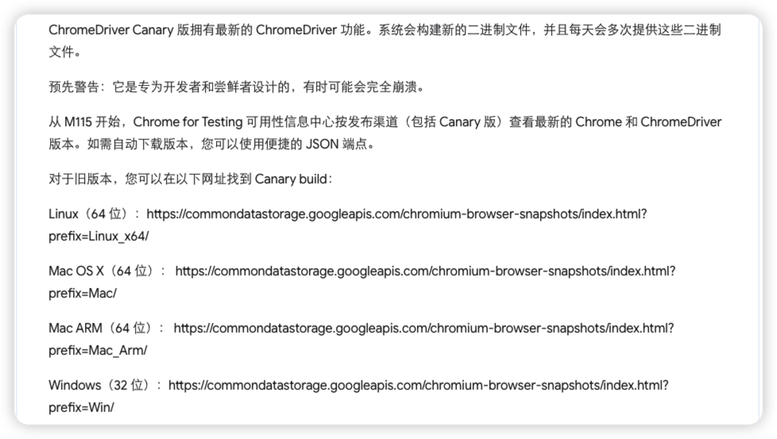
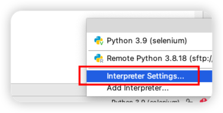
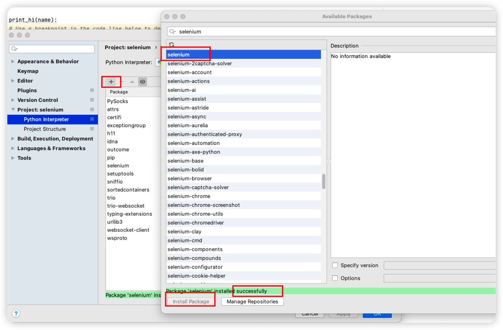

> Mac /Users/xiang/xiang/study/Python/selenium

## 1、Selenium 概述

[Selenium](https://www.selenium.dev/) 是Web自动化测试工具，最初是为了网站自动化测试开发的，可以直接运行在浏览器上，支持素有主流浏览器。
官网文档：[https://www.selenium.dev/zh-cn/documentation/](https://www.selenium.dev/zh-cn/documentation/)

需要安装浏览器驱动 [ChromeDriver](http://chromedriver.storage.googleapis.com/index.html)
镜像网站：[https://npmmirror.com/](https://npmmirror.com/)
找到浏览器相对应的版本：[chromedriver_mac64.zip](http://chromedriver.storage.googleapis.com/114.0.5735.90/chromedriver_mac64.zip)


上面的只有老版本
自己从官网找的：[https://developer.chrome.com/docs/chromedriver/downloads/canary?hl=zh-cn](https://developer.chrome.com/docs/chromedriver/downloads/canary?hl=zh-cn)
官方推荐版本：[https://googlechromelabs.github.io/chrome-for-testing/#stable](https://googlechromelabs.github.io/chrome-for-testing/#stable) ==（推荐）==




 Mac 使用这个地址：[https://commondatastorage.googleapis.com/chromium-browser-snapshots/index.html?prefix=Mac/](https://commondatastorage.googleapis.com/chromium-browser-snapshots/index.html?prefix=Mac/)


## 2、搭建Python虚拟环境

安装 seleniume 库

方法一（推荐）：



方法二：

```sh
pip install selenium==4.1.1
```


编写代码

```python
from selenium import webdriver
driver = webdriver.Chrome("./chromedriver")  
driver.get("http://www.baidu.com")
```


> [!WARNING]
> 1、如果碰到 # Python报错：NotOpenSSLWarning: urllib3 v2 only supports OpenSSL 1.1.1+, currently the ‘ssl‘ modul 这个报错，这样处理

```sh
// 1. 卸载
pip uninstall urllib3
// 2. 指定版本重新安装
pip install urllib3==1.26.15
```

> [!WARNING]
> 2、selenium 需要降低到 4.1.1 版本，才可以 webdriver.Chrome("./chromedriver")  使用


启动服务后，发现可以打开浏览器