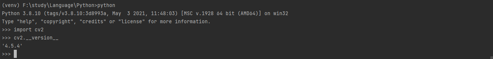

> 创建于 2021年11月23日
> 作者：想想

[toc]


## 安装Opencv 环境

### 1、需要现有Python环境

这里默认安装好了Python环境

```sh
(venv) F:\study\Language\Python\Project\PyProject>python -V
Python 3.8.10
```

### 2、下载环境

升级 `pip`  -> `python -m pip install --upgrade pip`

```sh
(venv) F:\study\Language\Python>python -m pip install --upgrade pip
Requirement already satisfied: pip in f:\study\language\python\project\pyproject\venv\lib\site-packages (21.1.2)
Collecting pip
  Downloading pip-21.3.1-py3-none-any.whl (1.7 MB)
     |████████████████████████████████| 1.7 MB 13 kB/s
Installing collected packages: pip
  Attempting uninstall: pip
    Found existing installation: pip 21.1.2
    Uninstalling pip-21.1.2:
      Successfully uninstalled pip-21.1.2
Successfully installed pip-21.3.1
```

下载 opencv-python `pip install opencv-python`

```sh
(venv) F:\study\Language\Python>pip install opencv-python
Collecting opencv-python
  Downloading opencv_python-4.5.4.60-cp38-cp38-win_amd64.whl (35.1 MB)
     |████████████████████████████████| 35.1 MB 48 kB/s
WARNING: Retrying (Retry(total=4, connect=None, read=None, redirect=None, status=None)) after connection broken by 'ReadTimeoutError("HTTPSConnectionPool(host='pyp
i.org', port=443): Read timed out. (read timeout=15)")': /simple/numpy/
Collecting numpy>=1.17.3
  Downloading numpy-1.21.4-cp38-cp38-win_amd64.whl (14.0 MB)
     |████████████████████████████████| 14.0 MB 97 kB/s
Installing collected packages: numpy, opencv-python
Successfully installed numpy-1.21.4 opencv-python-4.5.4.60
```

测试是否安装成功

```sh
(venv) F:\study\Language\Python>python
Python 3.8.10 (tags/v3.8.10:3d8993a, May  3 2021, 11:48:03) [MSC v.1928 64 bit (AMD64)] on win32
Type "help", "copyright", "credits" or "license" for more information.
>>> import cv2
>>> cv2.__version__
'4.5.4'
>>>
```



>  宝藏地址：[https://www.lfd.uci.edu/~gohlke/pythonlibs/](https://www.lfd.uci.edu/~gohlke/pythonlibs/) python 环境包地址