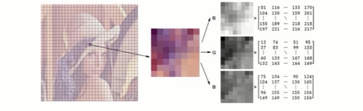
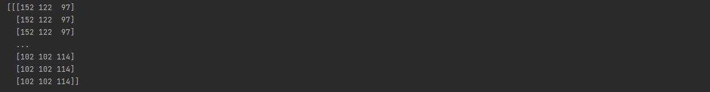

> 创建于 2021年11月23日
> 作者：想想

[toc]


## 图片的基本操作





先下载环境

```sh
pip install matplotlib
pip install opencv-python
```

`python` 文件

```python
import cv2
import matplotlib.pyplot as plt
import numpy as np

img=cv2.imread('images/test.jpg')
print(img)
```



查看图片

```python
# 图像的显示，也可以创建多个窗口
cv2.imshow('image',img)
# 等待时间，毫秒级，0表示任意键终止
cv2.waitKey(0)
cv2.destroyWindows()
```

获取图片的高度和宽度

```python
print(img.shape)
#(639, 710, 3)
```

分别代表 H、W，第三个的意思是表示 RGB彩色图，如下灰度图就没有第三个参数

```python
img2=cv2.imread('images/test.jpg',cv2.IMREAD_GRAYSCALE)
print(img2.shape)
#(639, 710)
```

保存

```python
img2=cv2.imread('images/test.jpg',cv2.IMREAD_GRAYSCALE)
cv2.imwrite('images.png',img2)
```

查看大小

```python
print(img2.size)
#453690
```

```python
print(img2.dtype)
#uint8
```


## 读取视频

+ cv2.VideoCapture 可以捕捉摄像头，用数字来控制不同的设备，比如0，1
+ 如果是视频文件，直接指定好路径即可

```python
import cv2
vc = cv2.VideoCapture('video/firePeople.mp4')


if vc.isOpened():
    open, frame = vc.read()
else:
    open = False

while open:
    ret, frame = vc.read()
    if frame is None:
        break
    if ret == True:
        gray = cv2.cvtColor(frame, cv2.COLOR_BGR2GRAY)
        cv2.imshow('result', gray)
        if cv2.waitKey(0) & 0xFF == 27:
            break
vc.release()
cv2.destoryAllWindows()
```

### 截取部分图像数据

```python
import cv2

def cv_show(name,img):
    cv2.imshow(name,img)
    cv2.waitKey(0)
    cv2.destroyAllWindows()

img2=cv2.imread('images/test.jpg',cv2.IMREAD_GRAYSCALE)
img3=img2[0:200,0:200]
cv_show('img3',img3)
```

### 颜色通道提取

```python
b,g,r=cv2.split(img)
```


