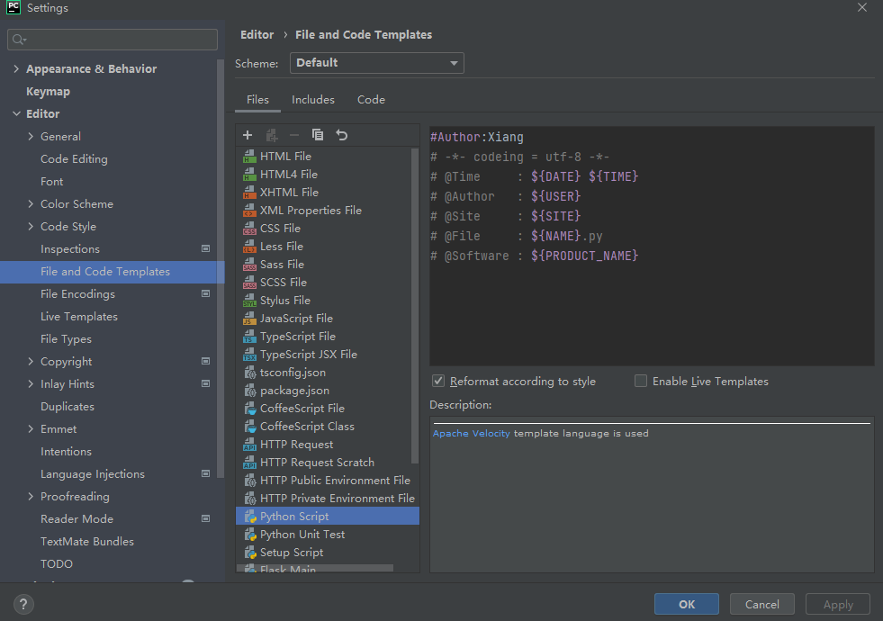
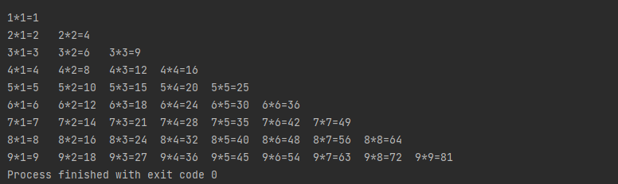

> 创建于2021年6月21日
>
> 作者：想想

[toc]


## Python

### 一、Python 概述

#### 1.1、基本概念

+ 1991年，第一个Python 编译器（同时也是解释器）诞生，它是用C语言实现的，并能调用C库（.so文件）从一出生，Python已经具有了 类、函数、异常处理，包含表和词典在内的核心类型，以及模块为基础的扩展系统
+ 2000年，Python 2.0 由 BeOpen PythonLabs 团队发布，加入内存回收机制，奠定了Python语言框架的基础
+ 2008年，Python 3 在一个意想不到的情况发布了，对语言进行了彻底的修改，没有向后兼容

#### 1.2、安装Python

Python IDE 下载路径  [https://www.jetbrains.com/pycharm/download/#section=windows](https://www.jetbrains.com/pycharm/download/#section=windows)

Python 语言 下载路径 [https://www.python.org/downloads/](https://www.python.org/downloads/)

破解资源  

链接: https://pan.baidu.com/s/1z6CR4gHYo2GzUgHSYp7n1g 

提取码: wbau 

#### 1.3、配置PyCharm

配置Python文件模板

Setttings > Editor > File and Code Templates 

找到 Python Script 文件，默认什么都没有，添加如下代码

```python
#Author:Xiang
# -*- codeing = utf-8 -*-
# @Time     : ${DATE} ${TIME}
# @Author   : ${USER}
# @Site     : ${SITE}
# @File     : ${NAME}.py
# @Software : ${PRODUCT_NAME}
```




### 二、Python 基本语法

#### 2.1、注释

单行注释 用 # 表示

多行注释用  

```python
'''
注释内容
'''
```

#### 2.2、变量及类型

1. 变量可以是任意的数据类型，在程序中用一个变量名表示
2. 变量名必须是 `大小写英文、数字和下划线(_)` 的组合，且不能以数字开头
3. 赋值 （比如 a = 'ABC' ）时，Python 解释器干了两件事
   1. 在内存中创建了 ‘ABC’ 的字符串
   2. 在内存中创建了一个名为 a 的变量，并且把他指向 ‘ABC’

#### 2.3、关键字

```python
import keyword
keyword.kwlist
```

查看所有关键字

#### 2.4、格式化输出

占位符 %d 表示数字

```python
age = 18
print("我的年纪是：%d 岁"%age)
```

%s 表示通过 str() 字符串转换来格式化

```python
name = "张三"
sex = "女"
print("我的名字是%s，我的性别是%s"%(name,sex))
```

%c 表示字符

%f 浮点和整数

#### 2.5、扩展

​		逗号默认空格输出

```python
print("aaa","bbb","ccc")
# aaa bbb ccc
```

​		`sep` 分隔符

```python
print("www","baidu","com",sep=".")
# www.baidu.com
```

​		`end` 结束符

```python
print("hello",end="")
print("world",end="\t")
print("python",end="\n")
print("end")
# helloworld	python
# end
```

#### 2.6、输入

```python
password = input("请输入密码:")
print("您刚刚输入的密码是：",password)
# 请输入密码:123456
# 您刚刚输入的密码是： 123456
```

判断变量类型 type(<class ?>)

```python
a = 1
print(type(a))

# <class 'int'>
```

```python
a = "abc"
print(type(a))

# <class 'str'>
```

​		强转

```python
a = "1"
print(type(a)) # <class 'str'>

a = int("1")
print(type(a)) # <class 'int'>
```

​		饶一点

```python
c = int(input("输入c："))
print("输入了一个数字:%d"%c)

# 输入c：200
# 输入了一个数字:200
```

#### 2.7、运算符

加减乘除 不说了，除法会出现小数

% 取模，返回除法的余数

** 幂，返回 x 的 y 次幂					3 ** 2 为3的2次方  3^2

// 取整数，向下取接近除数的整数   9//2 = 4

> 逻辑运算符
>
> and 、 or 、not  分别是 与、或、非
>
> 成员运算符
>
> in 、not in 

### 三、判断语句和循环语句

#### 3.1、条件判断语句

+ python 指定任何 非0和非空值为 True、0 或者 None为False

```python
if 100:
    print("True")
else:
    print("False")
print("End")
# 缩进不能少！ 且规范！ 空格和tab键都可以，但是要对齐
# True
# End
```

#### 3.2、循环

**==for==**

​		第一个参数，是循环开始的位置

​		第二个参数，是循环结束的位置

​		第三个参数，是步进值（每次叠加的数字），可以适用于字符串、数组

```python
for i in range(2):
    print(i,end=",")
# 0,1,

for i in range(0,10,3):
    print(i,end=",")
# 0,3,6,9,
# 从0-10 每次+3

for i in range(-10,-100,-30):
    print(i,end=",")
# -10,-40,-70,

name = "Hello World"
for x in name:
    print(x,end=".")
# H.e.l.l.o. .W.o.r.l.d.

a=["aa","bb","cc","dd"]
for i in range(1,len(a)):
    print(i,a[i],end=",")
# 1 bb,2 cc,3 dd,
```

**==while==**

​		循环内部需要步进值，请不要参数死循环，他不会停.....

```python
i = 0
while i<5:
    print("%d "%(i+1),end=",")
    i += 1
# 1 ,2 ,3 ,4 ,5 ,
```

案例：从0加到100

```python
sum = 0
i = 0
while i<100:
    i += 1
    sum += i
print(sum)
```

​		while 语句还有 else 指令，当跳出循环后，会执行 else 指令，除此之外，还有 break，continue，pass，值得一提的是 pass，pass 可以当做占位符，什么也不干，（想跳过，不占位报错！！）

案例：实现 99 乘法表

```python
for i in range(1,10):
    print(" ")
    for j in range(1,i+1):
        print("%d*%d=%d"%(i,j,i*j),end="\t")
```

