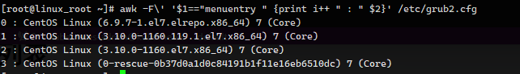

# CentOS内核升级

> 写作于：2025-01-07，由于官网无法直接内核升级
>
> 可用于Linux系统离线升级内核版本


原本iso镜像的内核版本是 3.10.0

但也有很多大佬推荐不再升级内核版本，但是又有很多工具需要高版本内核。

这里只讲方法，不讨论是否应该升级

参考简述：https://www.jianshu.com/p/73b3253dd752

英国镜像网站，一家 Coreix运营的免费服务：https://mirrors.coreix.net


> 多个版本从如下地址寻找：
>
> http://mirrors.coreix.net/elrepo-archive-archive/kernel/el7/x86_64/RPMS/


```sh
http://mirrors.coreix.net/elrepo-archive-archive/kernel/el7/x86_64/RPMS/kernel-ml-headers-6.9.7-1.el7.elrepo.x86_64.rpm
http://mirrors.coreix.net/elrepo-archive-archive/kernel/el7/x86_64/RPMS/kernel-ml-devel-6.9.7-1.el7.elrepo.x86_64.rpm
http://mirrors.coreix.net/elrepo-archive-archive/kernel/el7/x86_64/RPMS/kernel-ml-6.9.7-1.el7.elrepo.x86_64.rpm
```


百度网盘：安装资源>Linux>kernel


```sh
rpm -ih kernel-ml-6.9.7-1.el7.elrepo.x86_64.rpm

rpm -ih kernel-ml-devel-6.9.7-1.el7.elrepo.x86_64.rpm
```

查看安装的内核版本

```sh
awk -F\' '$1=="menuentry " {print i++ " : " $2}' /etc/grub2.cfg
```



设置为最新版本

```sh
grub2-set-default 0
```

生成 grub 配置文件

```sh
grub2-mkconfig -o /boot/grub2/grub.cfg
```

重启

```sh
reboot
```

卸载旧内核

```sh
yum remove kernel-headers
```

最后安装

```sh
rpm -ih kernel-ml-headers-6.9.7-1.el7.elrepo.x86_64.rpm
```

