[toc]

# awk

语法

```sh
awk [option] 'pattern[action]' file
awk  参数			'条件动作'   			 文件
```

awk 擅长文本格式化，且输出格式化后的结果，因此最常用的动作就是 print 和 printf

## 变量

| 内置变量              | 解释                            |
| --------------------- | ------------------------------- |
| $n                    | 指定分隔符后，当前记录的n个字段 |
| $0                    | 完整的输入记录                  |
| FS                    | 字段分隔符，默认是空格          |
| NF(Number of fields)  | 分割后，当前行有多少个字段      |
| NR(Number of records) | 当前记录行数                    |

## 参数

| 参数 | 解释                          |
| ---- | ----------------------------- |
| -F   | 指定分割字符                  |
| -v   | 定义或修改一个 awk 内部的变量 |
| -f   | 从脚本中读取 awk 命令         |

## 场景

### 列分割


有这样一个文件，只打印第二列

```sh
awk '{print $2}' alex.txt
```

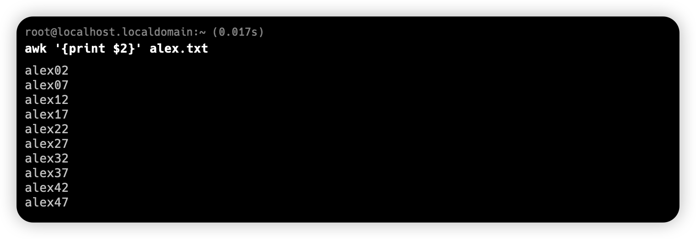

一次性输出 第二列和第四列

```sh
awk '{print $2,$4}' alex.txt
```

自定义输出内容

```sh
awk '{print "第二列",$2,"第四列"$4}' alex.txt
```

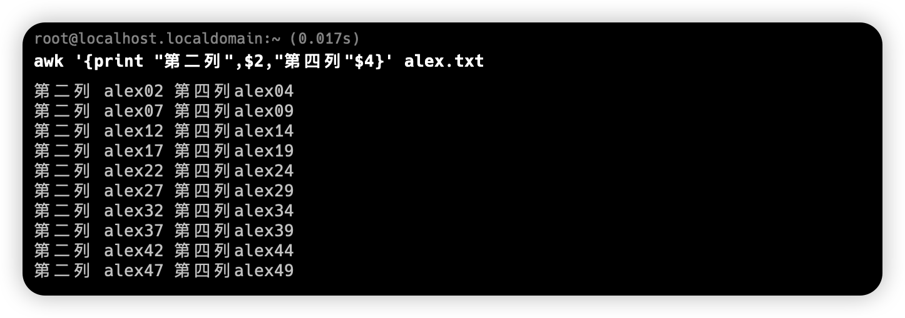

有逗号，就有空格，没有逗号，就不空格。

输出所有信息

```sh
awk '{print}' alex.txt
awk '{print $0}' alex.txt
```

### 行切割

创建一个文件 `cat /etc/passwd > pwd.txt`

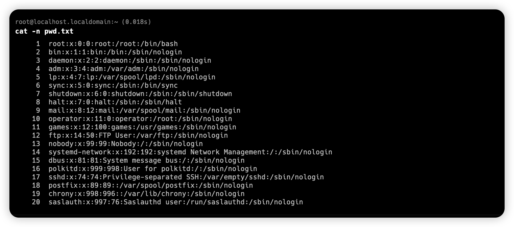

只显示第五行

```sh
awk 'NR==5'-n pwd.txt
```

显示 2-5 行

```sh
awk 'NR==2,NR==5' pwd.txt
```

显示 2、3、4、5 行

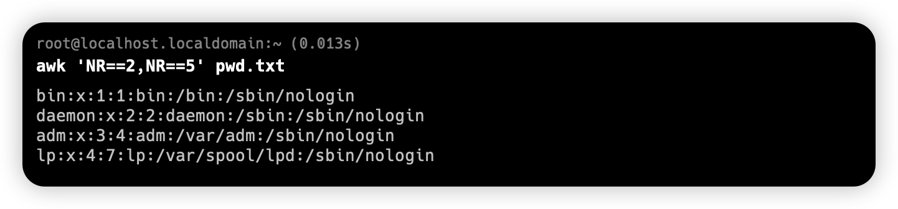

### 打印 IP

```sh
ifconfig ens33
```

我们可以定位到 第二行、第二列，就是我们所需的 IP 信息

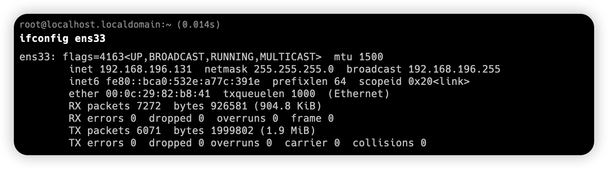

```sh
ifconfig ens33 | awk 'NR==2 {print $2}'
```


## -F 解决 : 冒号间隔

通过 `cat /etc/passwd > pwd.txt` 创建一个 `pwd.txt` 文件

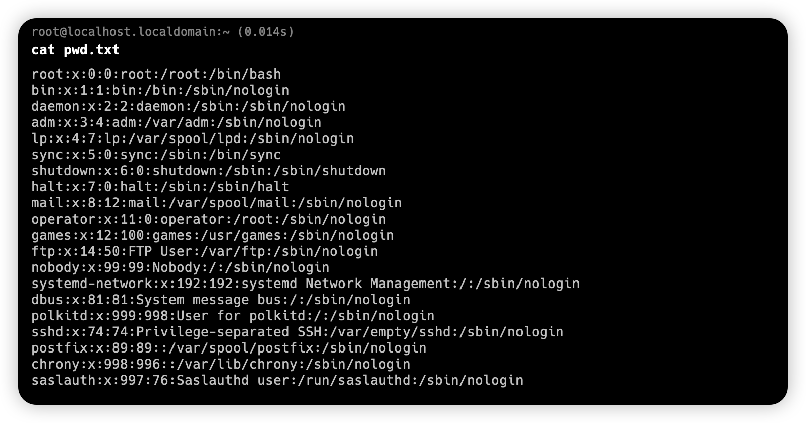

冒号看的有点乱，给他替换成 空格，然后再取出第三、四、五列

```sh
awk -F ':' '{print $3,$4,$5}' pwd.txt
```

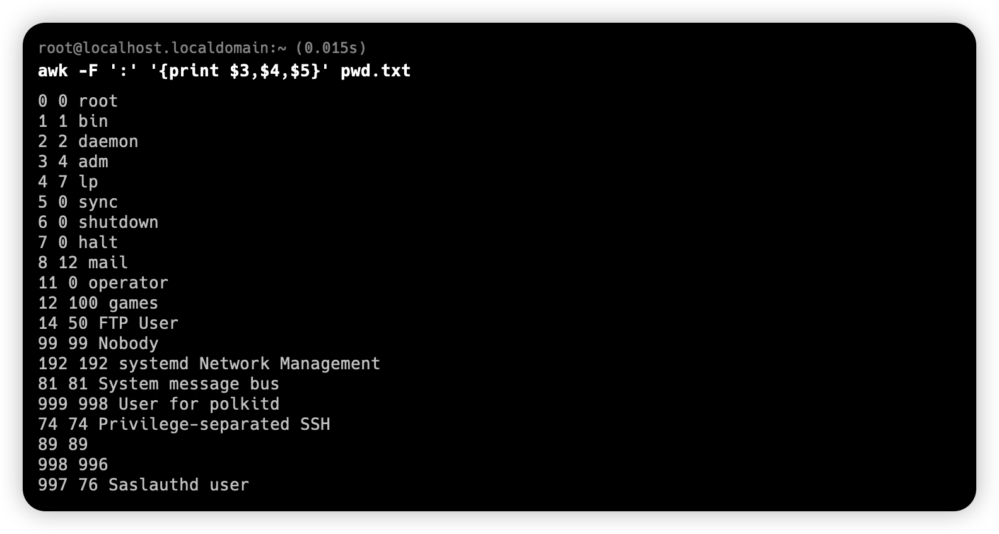

我就想拿倒数第二列和最后一列

```sh
awk -F ':' '{print $(NF-1),$NF}' pwd.txt
```

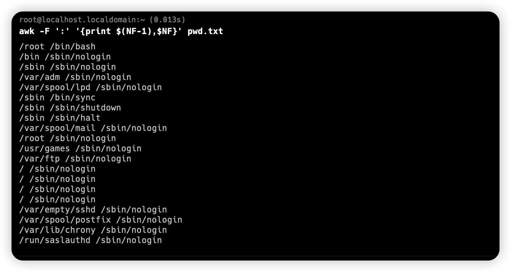

甚至碰到什么乱七八糟的分隔符，我们依旧可以使用 `-F ''` 来指定特殊分隔符


除了可以用 -F 来指定分隔符，我们也可以更改默认分隔符 FS

```sh
awk -v FS=':' '{print $1}' pwd.txt
```

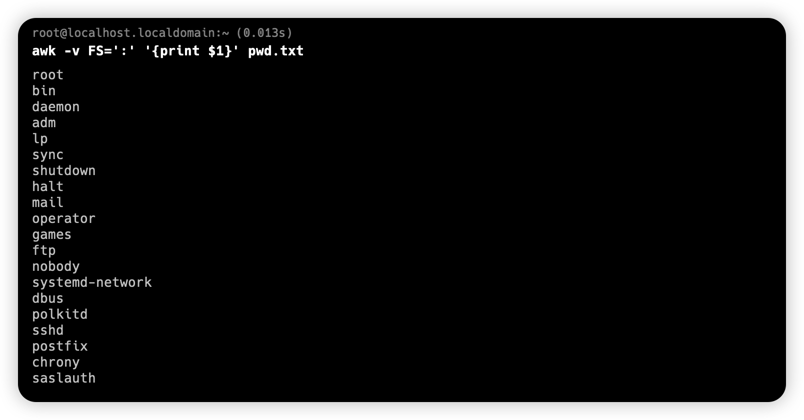

## OFS输出分隔符

我们知道 -v 可以修改默认分隔符，不仅可以修改默认输入分割符，也可以修改默认输出分隔符

```sh
awk -v FS=':' -v OFS='---' '{print $1,$3}' pwd.txt
```

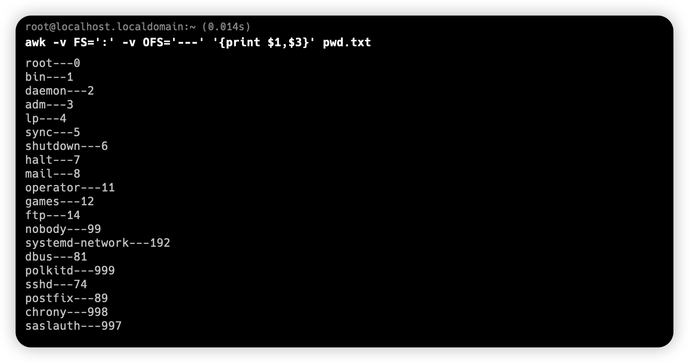

我们可以用 `\t` 让字符变得更好看

```sh
awk -v FS=':' -v OFS='\t\t' '{print $1,$3}' pwd.txt
```

## 内置变量 NR、NF

我想知道每一行又多少列，这样就可以打印列数

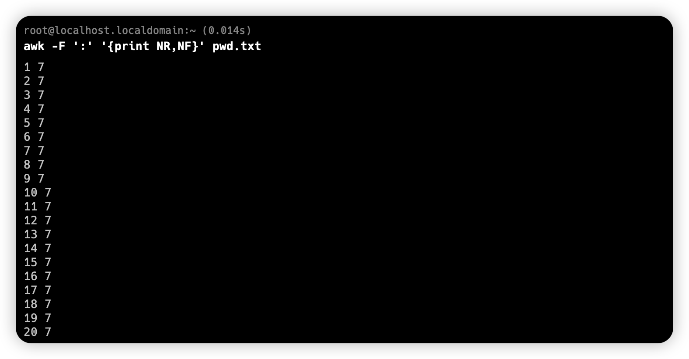

每行都有 7 列

显示一下文件名

```sh
awk '{print FILENAME,$0}' ps.txt
```

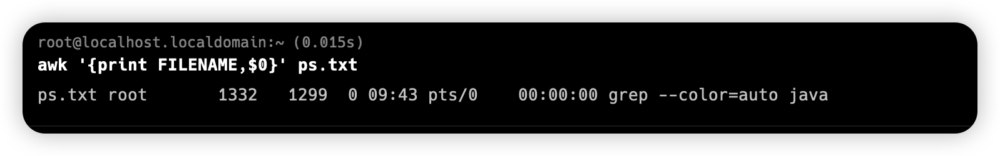

自定义变量 `-v value='hello'`

```sh
awk -v value='hello' '{print value,$0}' ps.txt
```


也可以间接引用 shell 

```sh
my='Good'
awk -v value=$my '{print value,$0}' ps.txt
```

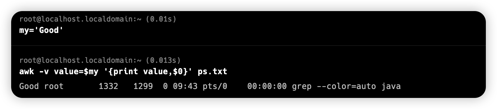

## printf 和 print 区别

学过 C 或 Go 语言的，肯定能随意玩耍了

```
%c				显示字符ASCII码
%d,%i			十进制整数
%e,%E			科学计数法显示
%f				显示浮点
%g,%G			以科学计数法格式或浮点格式显示数值
%s				显示字符串
%u				无符号整数
%%				显示%本身

示例： printf "%d"
```

```sh
printf "%s\n" a b c d
```

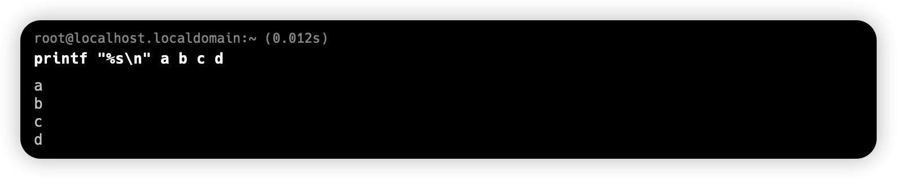

格式化打印用户信息，有这样 `user.txt` 文件

```
hello,18,beijing
wangli,20,shanghai
zhangshan,19,tianjing
lili,22,jiangxi
```


看我操作，自己琢磨去吧， `BEGIN` 在之前打印，

```sh
awk -F ',' 'BEGIN{printf "%-40s\t %-40s\t %-40s\n","姓名","年龄","地区"}{printf "%-35s\t %-35s\t %-35s\n",$1,$2,$3}' user.txt
```

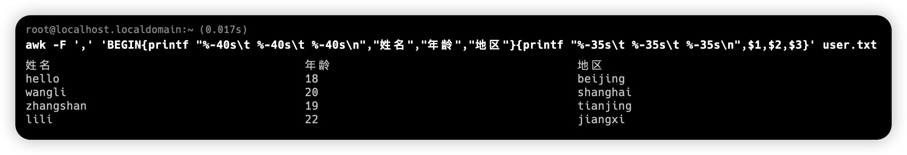

## BEGINE 和 END

```sh
awk 'BEGIN{ commands } pattern{ commands } END{ commands }'
```

```sh
awk 'BEGIN{print "前面"}{print $0}END{print "后面"}' ps.txt
```

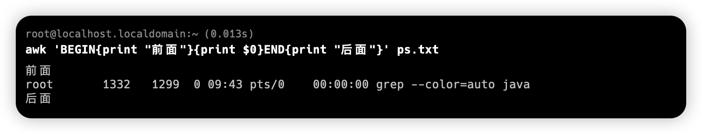

