[toc]

# grep

## 参数

语法

```
grep [options] [pattern] file
命令   参数      匹配模式   文件名
```

现有 `ip.txt` 文件 ，可以通过 `ifconfg > ip.txt` 得到

```
1: lo: <LOOPBACK,UP,LOWER_UP> mtu 65536 qdisc noqueue state UNKNOWN group default qlen 1000
    link/loopback 00:00:00:00:00:00 brd 00:00:00:00:00:00
    inet 127.0.0.1/8 scope host lo
       valid_lft forever preferred_lft forever
    inet6 ::1/128 scope host 
       valid_lft forever preferred_lft forever
2: ens33: <BROADCAST,MULTICAST,UP,LOWER_UP> mtu 1500 qdisc pfifo_fast state UP group default qlen 1000
    link/ether 00:0c:29:82:b8:41 brd ff:ff:ff:ff:ff:ff
    inet 192.168.196.131/24 brd 192.168.196.255 scope global noprefixroute dynamic ens33
       valid_lft 1652sec preferred_lft 1652sec
    inet6 fe80::bca0:532e:a77c:391e/64 scope link noprefixroute 
       valid_lft forever preferred_lft forever
```

以上述文件进行实验

### -i 忽略大小写 匹配

```shell
grep -i "mu" ip.txt
```

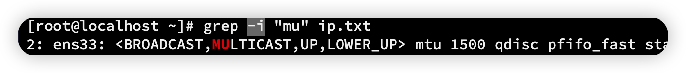

### -n 现实匹配行行号

```shell
grep -i -n "mu" ip.txt 
```

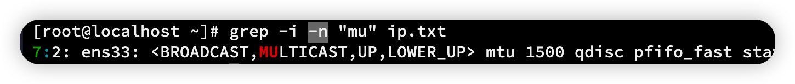

### -v 排除匹配结果

```shell
grep -i -n -v "mu" ip.txt
```

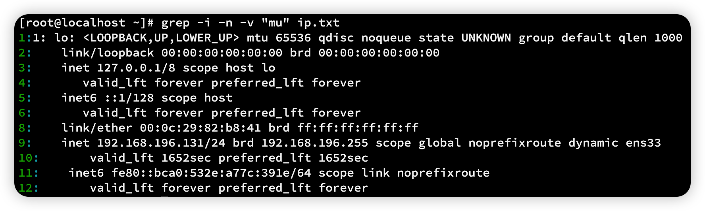

除了第 7 行，都匹配了出来

### -o 只显示匹配的值

```shell
grep -n -o 'a' ip.txt
```

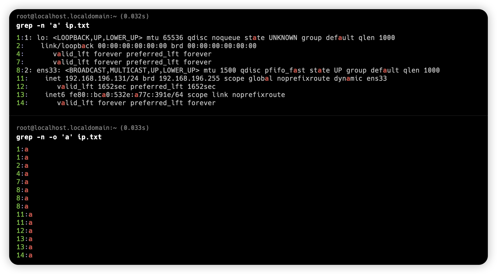

这样可以匹配出文中出现多少个 'a'

```shell
grep -n -o 'a' ip.txt | wc -l
```


## BRE 正则匹配

### ^ 符号

输出所有 2 开头字符 `"^2"` ，并且输出行号 `-n`

```shell
grep -n "^2" ip.txt
```

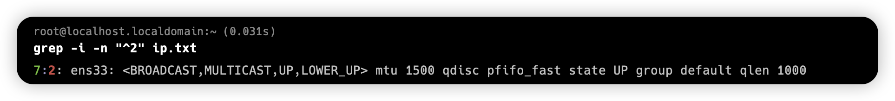

### $符

输出以 r 结尾的 `"r$"`

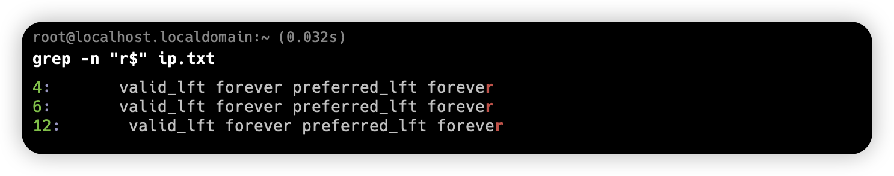

注意，在 Linux 平台，所有文件都会有个 $ 结尾

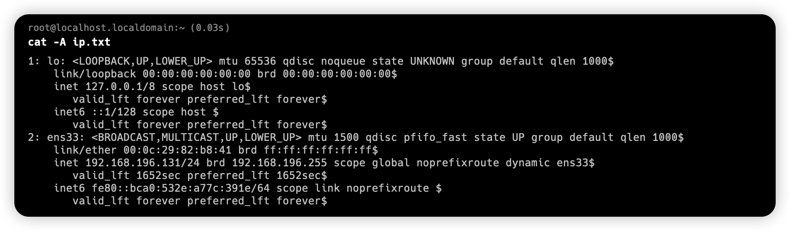

输出以 `.` 结尾的字符需要转移 `"\.$"`

### ^$ 组合符

找出文件中空行

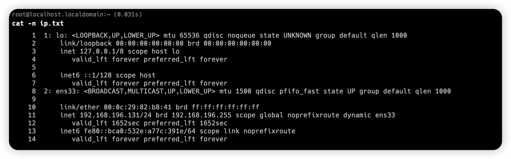

```sh
grep "^$" -n ip.txt
```


### . 符号

`.` 表示任意一个字符，有且只有一个，单独一个`.` 全局匹配

```sh
grep -n -i "." ip.txt
```

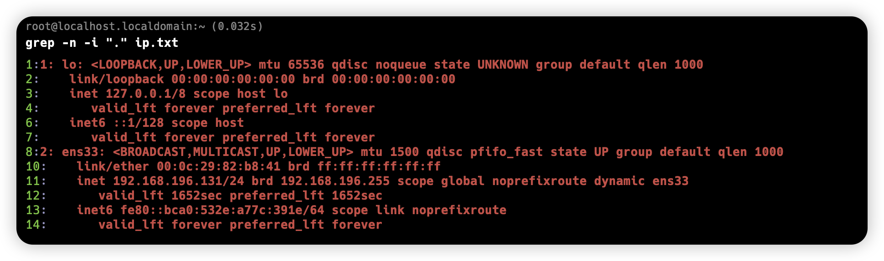

匹配 `".ost"` 任意四个字符，包含 `ost`

```sh
grep -n -i ".ost" ip.txt
```


### \转义符

匹配文中的 `.` 点 `"\."`  p

~~~shell
grep -n -i ".ost" ip.txt
~~~

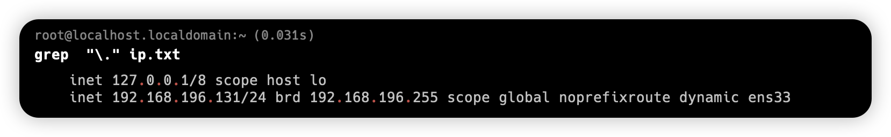

### .*组合

. 表示匹配字符，~*~  匹配前一个字符 0次或多次，放到一起，表示匹配所有内容，包括空格

### ^.*o 符

+ ^ 以某字符开头
+ . 任意 0 个或多个字符
+ .* 代表匹配所有内容
+ o 普通字符，一直到字母 o 结束

`"n.*e"` 代表 n开头 e结尾

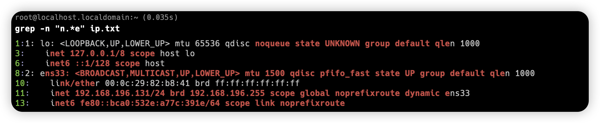

### [abc] 中括号

匹配中括号中任意一个字符

+ [a-z] 匹配所有小写字母
+ [A-Z] 匹配所有大写字母
+ [a-zA-Z] 匹配所有字母
+ [0-9] 匹配所有数字
+ [a-zA-Z0-9] 匹配所有字母数字

~~~shell
grep -n "[0-9]" ip.txt
~~~

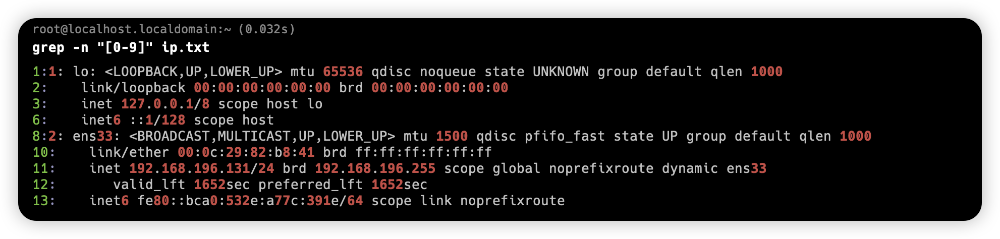

**[^abc] 中括号取反**

1. 找出除了小写字母之外的字符

```shell
grep "[^a-z]" ip.txt
```

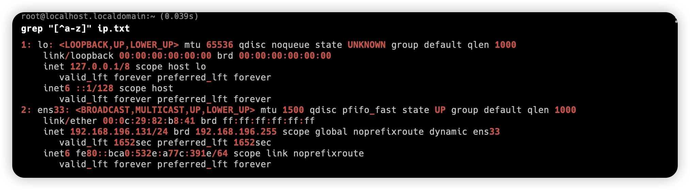

## 扩展正则表达式

### + 符

\+ 表示匹配前一个字符 1次 或多次，必须使用 grep -E 扩展正则

```shell
grep "[^a-z]" ip.txt
```

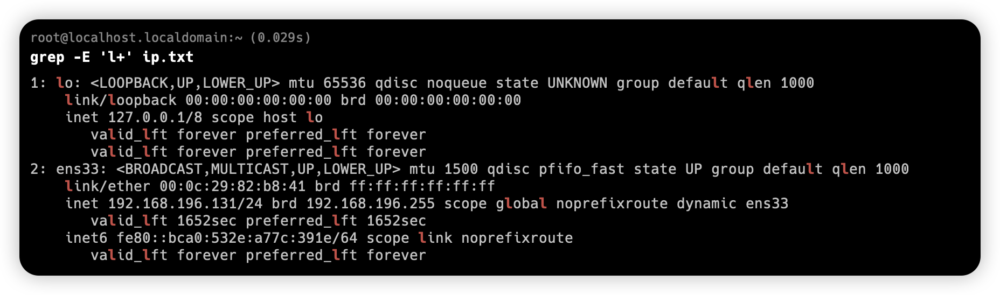

### | 符

或的意思

```shell
find  / -maxdepth 3 -name "*.txt" | grep -E "ps|ip"
```

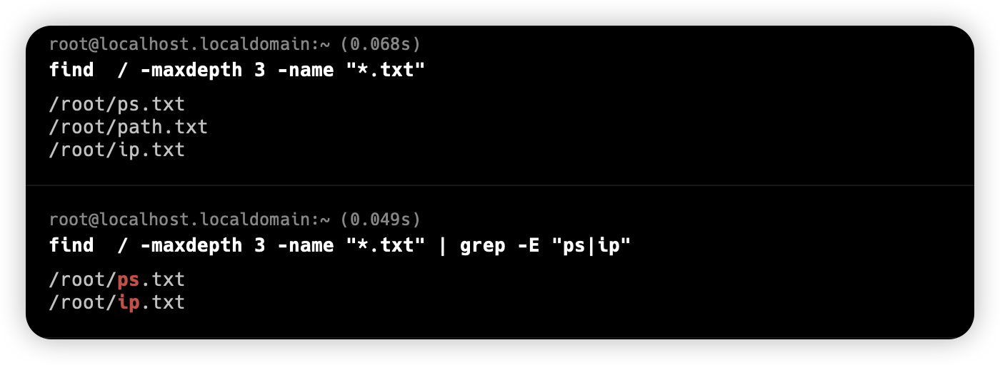

### () 括号

捆绑处理

```shell
find  / -maxdepth 3 -name "*.txt" | grep -E "/(ps|ip).txt"
```


```shell
grep -E '(r..t).*\1' /etc/passwd
```

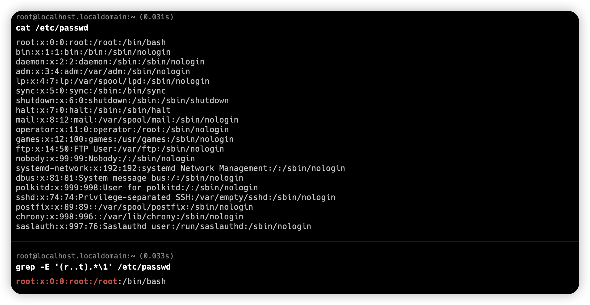

**扩展**

找出用户名和 shell 名同名的行

```sh
grep -E "^([^:]+\>).*\1$" /etc/passwd
```


解析步骤

1. 找出 ：冒号以外多的字符

~~~shell
grep -E "[^:]+" /etc/passwd
~~~

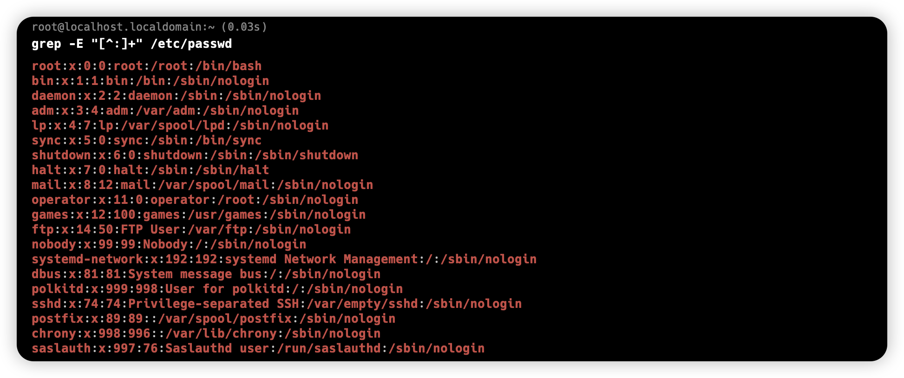

2. 找出冒号以外多的字符的开头字符

```shell
grep -E "^[^:]+" /etc/passwd
```

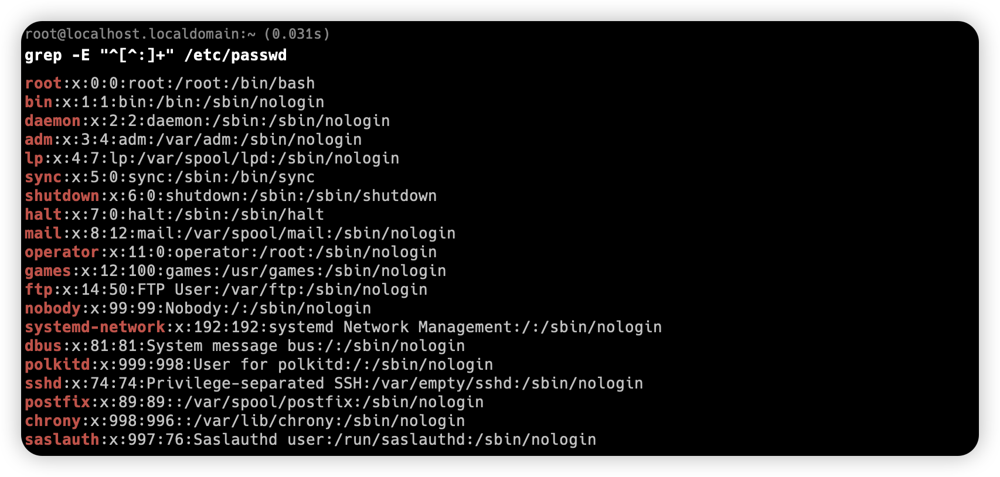

3. 重点，`\>` 表示瞄点 现有的 `^[^:]+` 加上括号 `(^[^:]+)` 再匹配结尾 `.*\1$`

```shell
grep -E "(^[^:]+\>).*\1$" /etc/passwd
```

