[toc]

# Sed

sed 是 Stream Editor（字符编辑器）的缩写

sed 是操作、过滤和转换文本内容的强大工具

语法

```
sed [选项] [swd内置命令字符] [输入文件]
```

| 参数 | 解释                                               |
| ---- | -------------------------------------------------- |
| -n   | 取消 sed 的输出，常常与 sed 内置命令 -p 一起使用   |
| -i   | 直接将修改结果写入文件，如果不用，则是在内存中显示 |
| -e   | 多次编辑，不需要管道符                             |
| -r   | 支持正则扩展                                       |

sec 常用内置命令字符

| 内置命令          | 解释                                                  |
| ----------------- | ----------------------------------------------------- |
| a                 | apeend，对文本进行最佳，再指定行后面添加一行/多行文本 |
| d                 | 删除匹配行                                            |
| i                 | insert 表示插入文本                                   |
| p                 | print 打印                                            |
| s/正则/替换内容/g | 正则匹配，然后替换文件，结尾 g 表示全局匹配           |

sed 匹配范围

| 范围      | 解释                                     |
| --------- | ---------------------------------------- |
| 空地址    | 全文处理                                 |
| 单地址    | 指定某一行                               |
| /pattern/ | 被匹配的每一行                           |
| 范围区间  | 10,20 十到二十行，10,+5 第十行向下五行， |
| 步长      | 1~2 表示 1,3,4,5 行，2~2 表示 2,4,6,8 行 |


## 参数

测试文件

```
My name is chaoge.
I teach linux.
I like play computer game.
My mail is array_xiangxiang@163.com.

My website is http://liuyuncen.com.
```

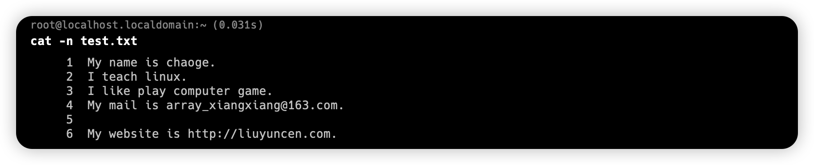

### -n 输出自定行

1. 输出文件第2 ，3 行

```shell
sed -n '2,3p' test.txt
```

`-n` 表示第几行  `p` 表示打印

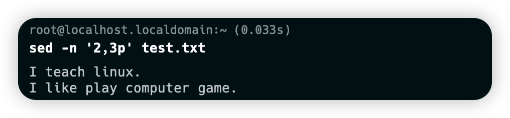

不带 p 就不打印

不带 -n 就全局输出

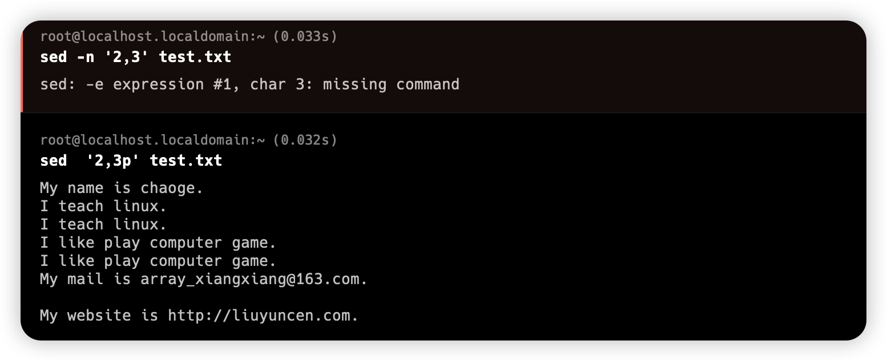

2. 过滤含有 linux 的字符航

```shell
sed -n '/linux/p' test.txt
```

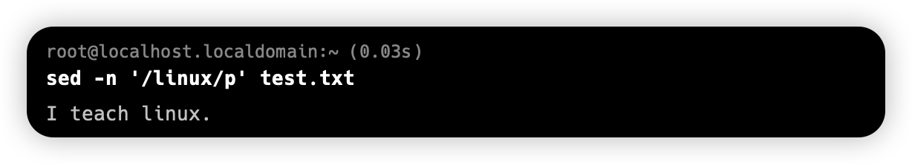

### -d 删除 -i 持久化

```
sed '/game/d' test.txt
```

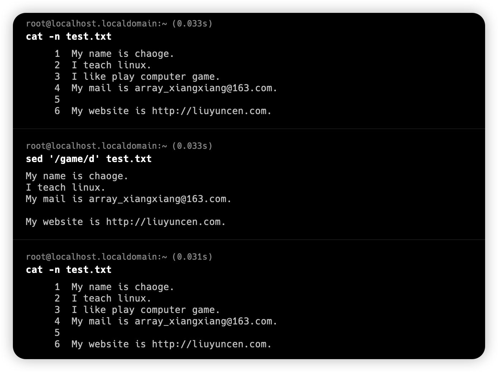

因为没有 -i 所以，只是内存中删除，没有写入磁盘

```shell
sed -i '/game/d' test.txt
```

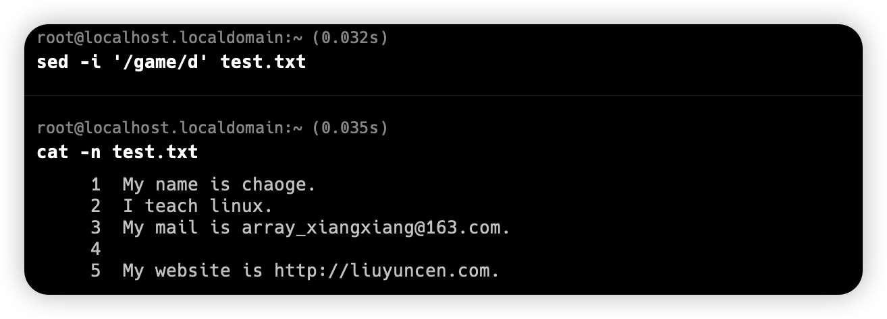

删除后不会理解打印

删除 2,3 两行

```shell
sed -i '2,3d' text.txt
```

删除第5行到结尾

```shell
sed -i '5,$d' text.txt
```

## 场景

### 将文件中的 My 替换为 His

```shell
sed -i 's/My/His/g' test.txt
```

不要忘记 -i 了喔

### 替换 His 为 My ，同时替换邮箱

```shell
sed -i -e 's/His/My/g' -e 's/array_xiangxiang@163.com/arrayxiangxiang@gmial.com/g' test.txt
```

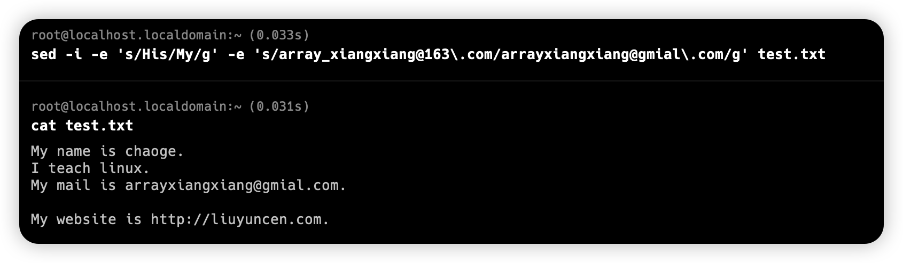

注意：`.` 记得用转译字符 `'\.'`

### 在第二行追加内容

```shell
sed -i '2a I is bad IT' test.txt
```

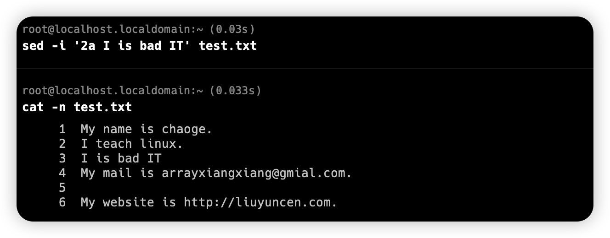

### 添加多行信息

```sh
sed -i '3a I like gril.\nI like beautiful gril' test.txt
```

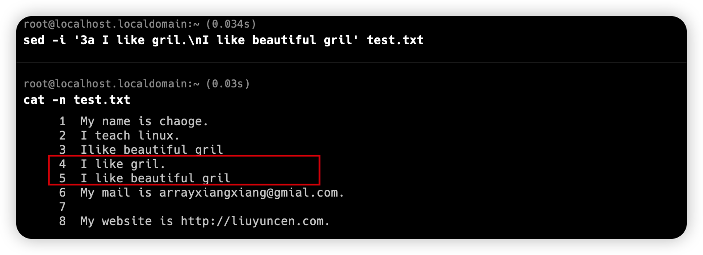

`\n` 代表换行

### 在每一行下面都添加

```shell
sed "a ------" test.txt
```

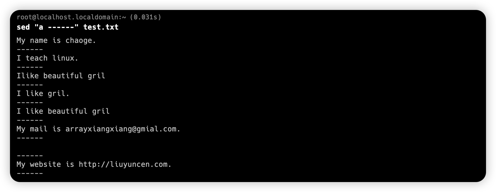

### 在最后一行添加

```shell
sed -i '1i添加的内容' filename # 在第一行前添加字符串 
sed -i '$i添加的内容' filename # 在最后一行行前添加字符串 
sed -i '$a添加的内容' filename # 在最后一行行后添加字符串
```

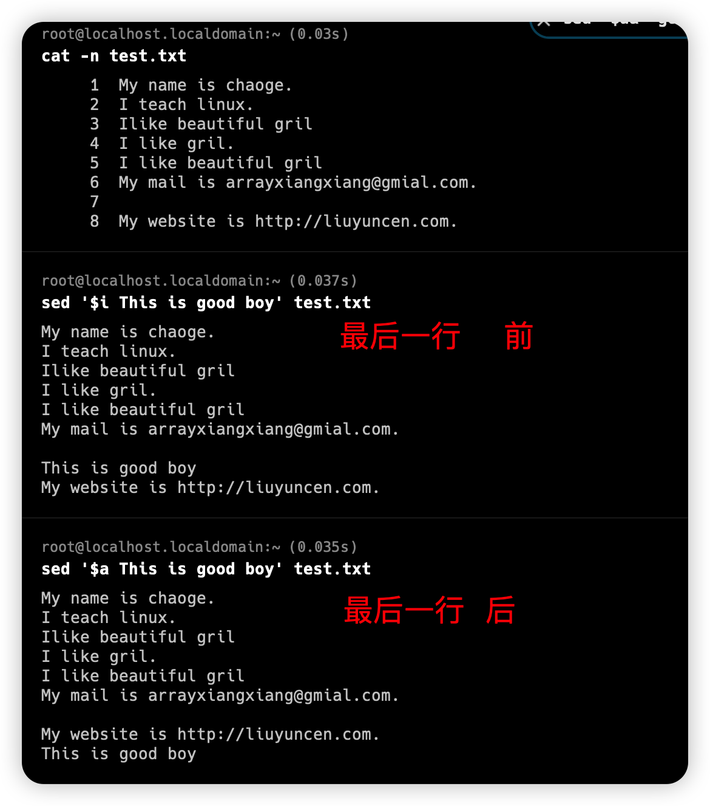

### 去除 Linux 的IP

结合正则，交给管道，掐头去尾法

1. 获取第二行

```sh
ifconfig | sed -n '2p'
```

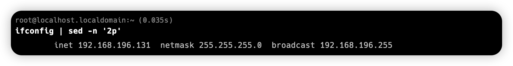

2. /// 三斜杠替换法，### 也可以，@@@也可以

```sh
ifconfig ens33 | sed -n '2s/^.*inet//gp'
```

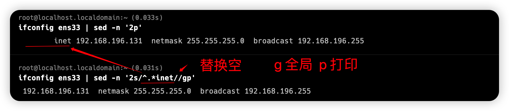

3. 再管道一次，去尾

```shell
ifconfig ens33 | sed -n '2s/^.*inet//gp'| sed -n 's/net.*$//gp'
```

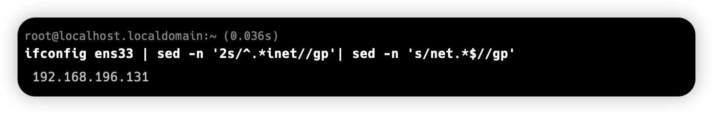

也可以直接用 `-e` 解决

```shell
ifconfig ens33 | sed -ne '2s/^.*inet//g' -e '2s/net.*$//gp'
```

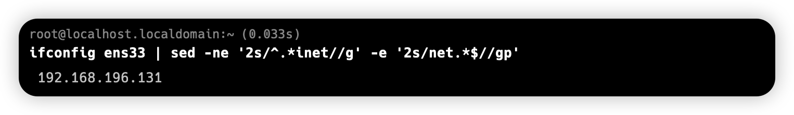

