[toc]

# grep

## 参数

语法

```
grep [options] [pattern] file
命令   参数      匹配模式   文件名
```

现有 `ip.txt` 文件 ，可以通过 `ifconfg > ip.txt` 得到

```
1: lo: <LOOPBACK,UP,LOWER_UP> mtu 65536 qdisc noqueue state UNKNOWN group default qlen 1000
    link/loopback 00:00:00:00:00:00 brd 00:00:00:00:00:00
    inet 127.0.0.1/8 scope host lo
       valid_lft forever preferred_lft forever
    inet6 ::1/128 scope host 
       valid_lft forever preferred_lft forever
2: ens33: <BROADCAST,MULTICAST,UP,LOWER_UP> mtu 1500 qdisc pfifo_fast state UP group default qlen 1000
    link/ether 00:0c:29:82:b8:41 brd ff:ff:ff:ff:ff:ff
    inet 192.168.196.131/24 brd 192.168.196.255 scope global noprefixroute dynamic ens33
       valid_lft 1652sec preferred_lft 1652sec
    inet6 fe80::bca0:532e:a77c:391e/64 scope link noprefixroute 
       valid_lft forever preferred_lft forever
```

以上述文件进行实验

### -i 忽略大小写 匹配

```shell
grep -i "mu" ip.txt
```

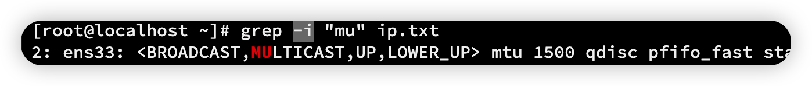

### -n 现实匹配行行号

```shell
grep -i -n "mu" ip.txt 
```

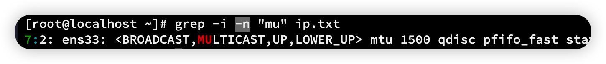

### -v 排除匹配结果

```shell
grep -i -n -v "mu" ip.txt
```

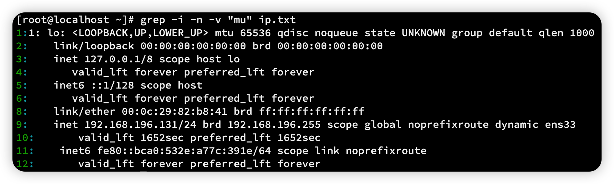

除了第 7 行，都匹配了出来

### -o 只显示匹配的值

```shell
grep -n -o 'a' ip.txt
```

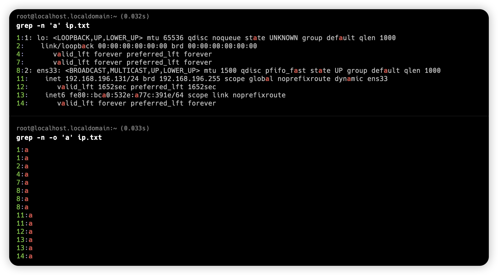

这样可以匹配出文中出现多少个 'a'

```shell
grep -n -o 'a' ip.txt | wc -l
```

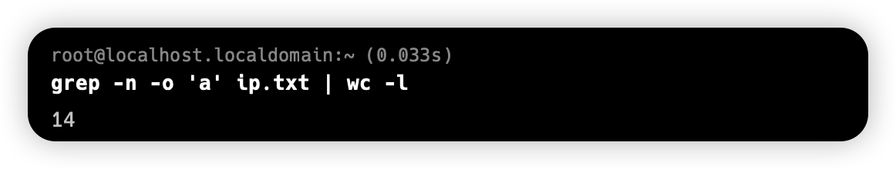

## BRE 正则匹配

### ^ 符号

输出所有 2 开头字符 `"^2"` ，并且输出行号 `-n`

```shell
grep -n "^2" ip.txt
```

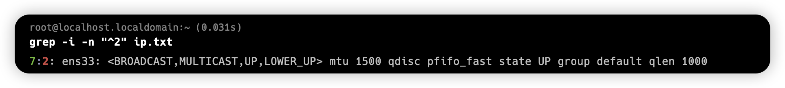

### $符

输出以 r 结尾的 `"r$"`

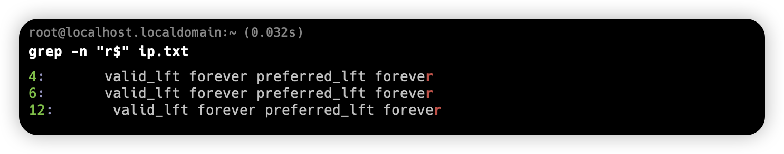

注意，在 Linux 平台，所有文件都会有个 $ 结尾

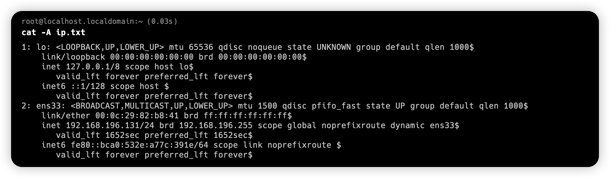

输出以 `.` 结尾的字符需要转移 `"\.$"`

### ^$ 组合符

找出文件中空行

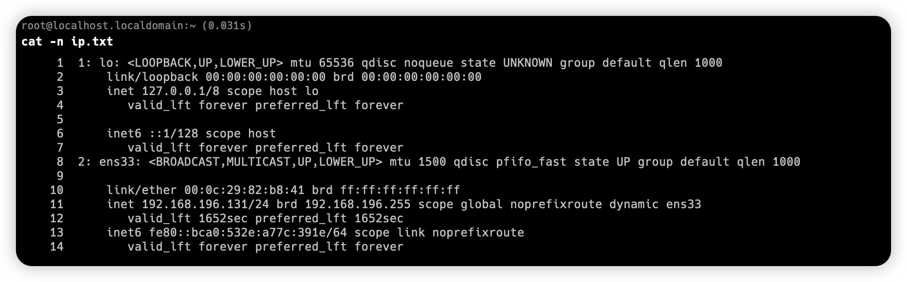

```sh
grep "^$" -n ip.txt
```

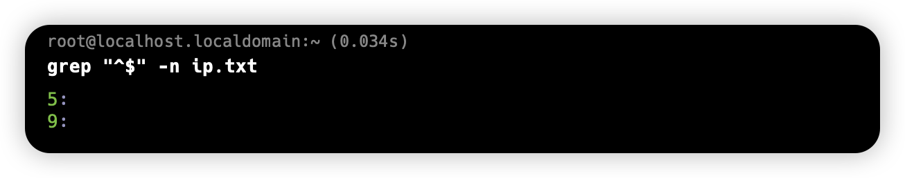

### . 符号

`.` 表示任意一个字符，有且只有一个，单独一个`.` 全局匹配

```sh
grep -n -i "." ip.txt
```

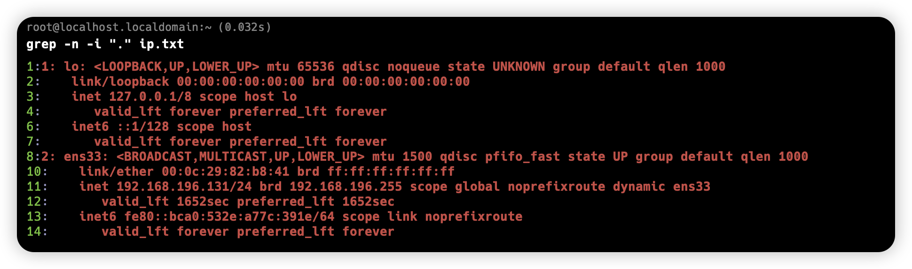

匹配 `".ost"` 任意四个字符，包含 `ost`

```sh
grep -n -i ".ost" ip.txt
```

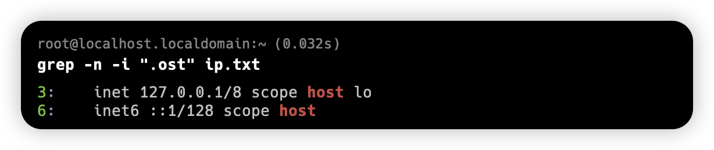

### \转义符

匹配文中的 `.` 点 `"\."`  p

~~~shell
grep -n -i ".ost" ip.txt
~~~

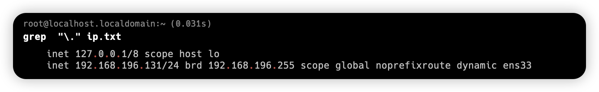

### .*组合

. 表示匹配字符，~*~  匹配前一个字符 0次或多次，放到一起，表示匹配所有内容，包括空格

### ^.*o 符

+ ^ 以某字符开头
+ . 任意 0 个或多个字符
+ .* 代表匹配所有内容
+ o 普通字符，一直到字母 o 结束

`"n.*e"` 代表 n开头 e结尾

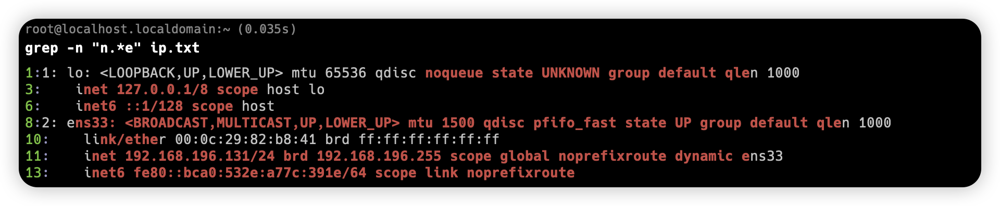

### [abc] 中括号

匹配中括号中任意一个字符

+ [a-z] 匹配所有小写字母
+ [A-Z] 匹配所有大写字母
+ [a-zA-Z] 匹配所有字母
+ [0-9] 匹配所有数字
+ [a-zA-Z0-9] 匹配所有字母数字

~~~shell
grep -n "[0-9]" ip.txt
~~~

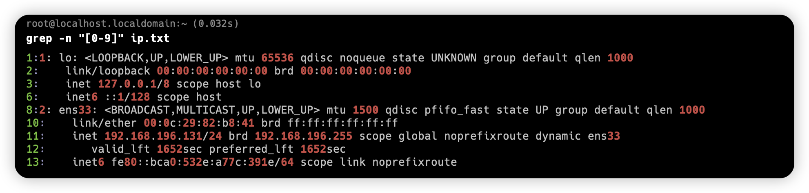

**[^abc] 中括号取反**

1. 找出除了小写字母之外的字符

```shell
grep "[^a-z]" ip.txt
```

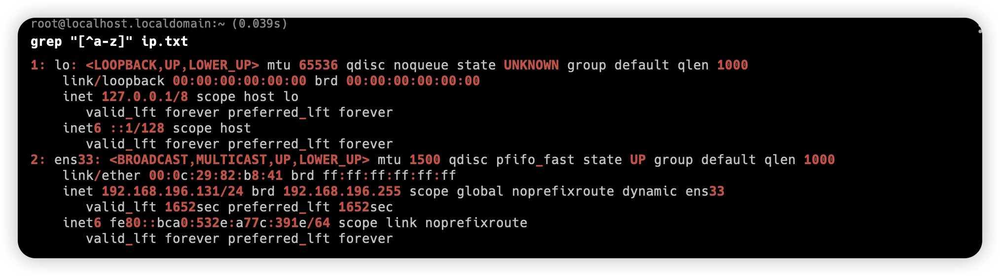

## 扩展正则表达式

### + 符

\+ 表示匹配前一个字符 1次 或多次，必须使用 grep -E 扩展正则

```shell
grep "[^a-z]" ip.txt
```

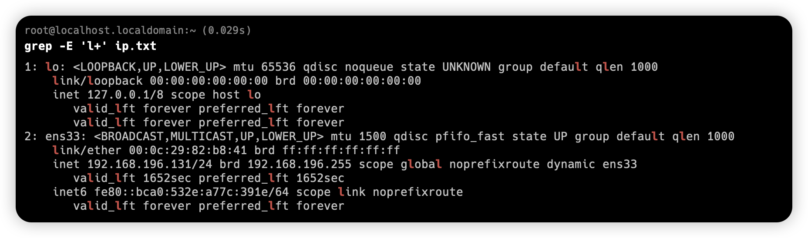

### | 符

或的意思

```shell
find  / -maxdepth 3 -name "*.txt" | grep -E "ps|ip"
```

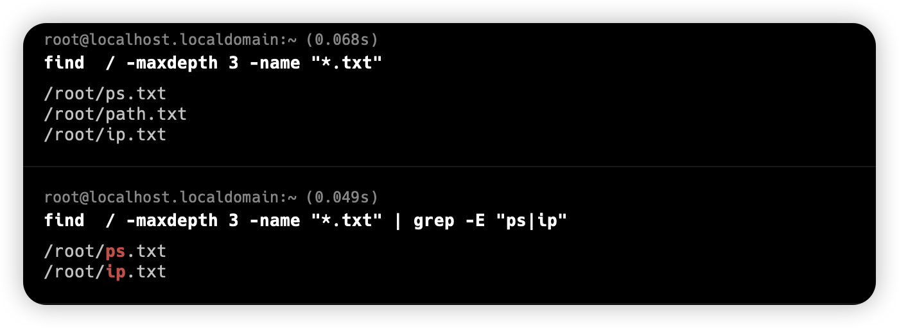

### () 括号

捆绑处理

```shell
find  / -maxdepth 3 -name "*.txt" | grep -E "/(ps|ip).txt"
```


```shell
grep -E '(r..t).*\1' /etc/passwd
```

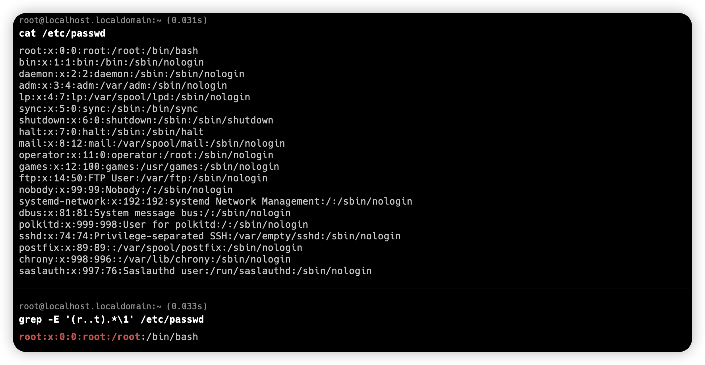

**扩展**

找出用户名和 shell 名同名的行

```sh
grep -E "^([^:]+\>).*\1$" /etc/passwd
```

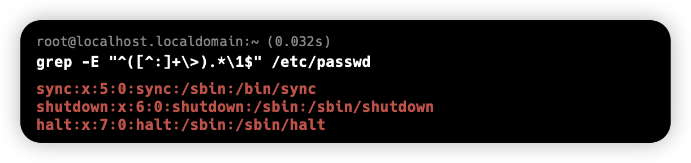

解析步骤

1. 找出 ：冒号以外多的字符

~~~shell
grep -E "[^:]+" /etc/passwd
~~~

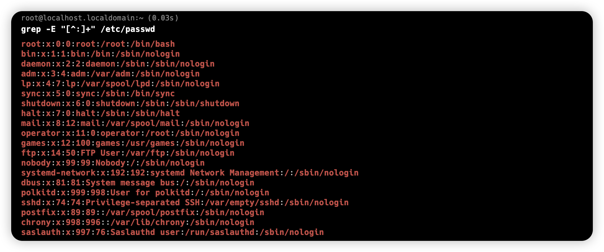

2. 找出冒号以外多的字符的开头字符

```shell
grep -E "^[^:]+" /etc/passwd
```

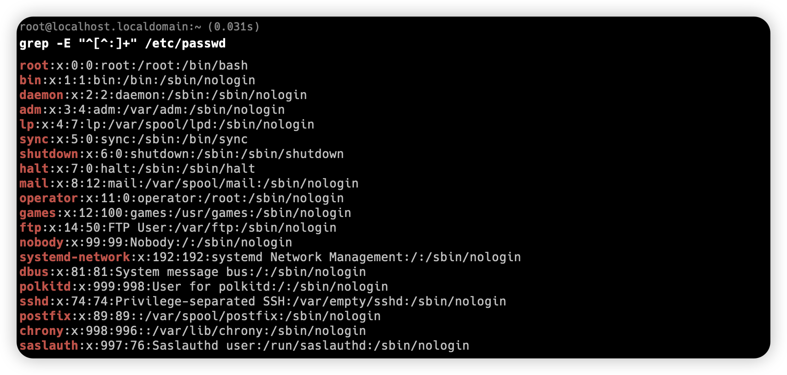

3. 重点，`\>` 表示瞄点 现有的 `^[^:]+` 加上括号 `(^[^:]+)` 再匹配结尾 `.*\1$`

```shell
grep -E "(^[^:]+\>).*\1$" /etc/passwd
```

# Sed

sed 是 Stream Editor（字符编辑器）的缩写

sed 是操作、过滤和转换文本内容的强大工具

语法

```
sed [选项] [swd内置命令字符] [输入文件]
```

| 参数 | 解释                                               |
| ---- | -------------------------------------------------- |
| -n   | 取消 sed 的输出，常常与 sed 内置命令 -p 一起使用   |
| -i   | 直接将修改结果写入文件，如果不用，则是在内存中显示 |
| -e   | 多次编辑，不需要管道符                             |
| -r   | 支持正则扩展                                       |

sec 常用内置命令字符

| 内置命令          | 解释                                                  |
| ----------------- | ----------------------------------------------------- |
| a                 | apeend，对文本进行最佳，再指定行后面添加一行/多行文本 |
| d                 | 删除匹配行                                            |
| i                 | insert 表示插入文本                                   |
| p                 | print 打印                                            |
| s/正则/替换内容/g | 正则匹配，然后替换文件，结尾 g 表示全局匹配           |

sed 匹配范围

| 范围      | 解释                                     |
| --------- | ---------------------------------------- |
| 空地址    | 全文处理                                 |
| 单地址    | 指定某一行                               |
| /pattern/ | 被匹配的每一行                           |
| 范围区间  | 10,20 十到二十行，10,+5 第十行向下五行， |
| 步长      | 1~2 表示 1,3,4,5 行，2~2 表示 2,4,6,8 行 |


## 参数

测试文件

```
My name is chaoge.
I teach linux.
I like play computer game.
My mail is array_xiangxiang@163.com.

My website is http://liuyuncen.com.
```


### -n 输出自定行

1. 输出文件第2 ，3 行

```shell
sed -n '2,3p' test.txt
```

`-n` 表示第几行  `p` 表示打印


不带 p 就不打印

不带 -n 就全局输出

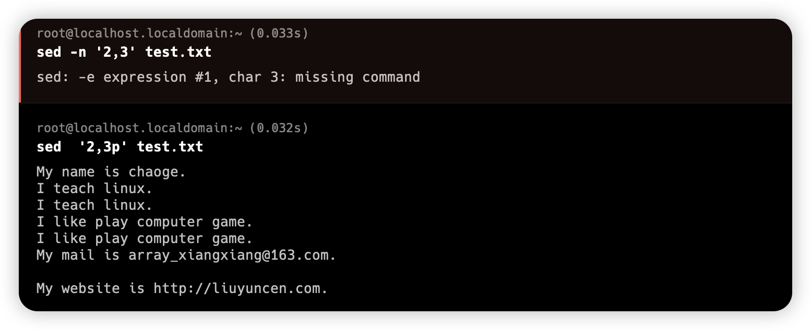

2. 过滤含有 linux 的字符航

```shell
sed -n '/linux/p' test.txt
```


### -d 删除 -i 持久化

```
sed '/game/d' test.txt
```

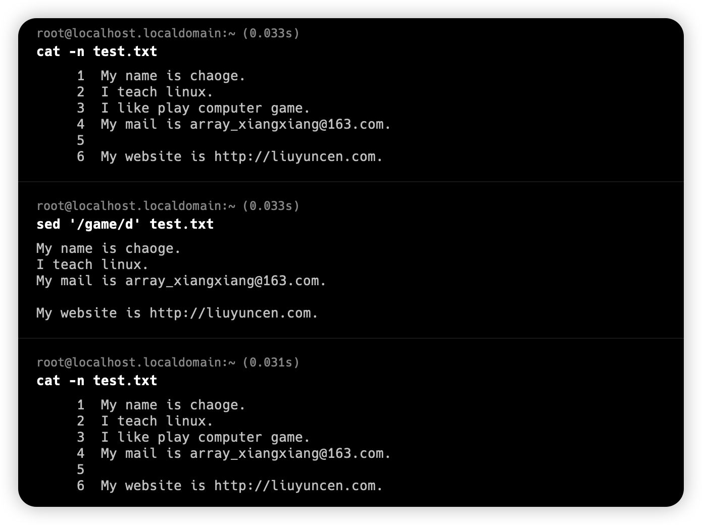

因为没有 -i 所以，只是内存中删除，没有写入磁盘

```shell
sed -i '/game/d' test.txt
```

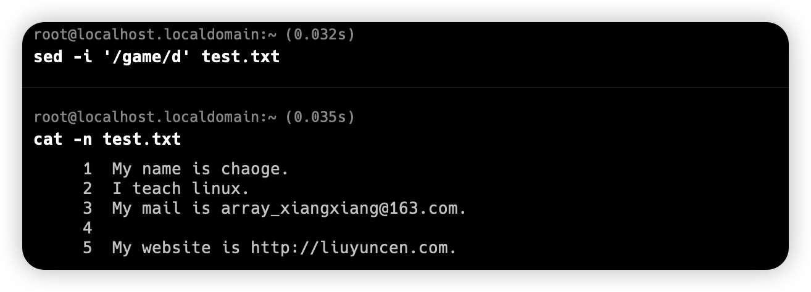

删除后不会理解打印

删除 2,3 两行

```shell
sed -i '2,3d' text.txt
```

删除第5行到结尾

```shell
sed -i '5,$d' text.txt
```

## 场景

### 将文件中的 My 替换为 His

```shell
sed -i 's/My/His/g' test.txt
```

不要忘记 -i 了喔

### 替换 His 为 My ，同时替换邮箱

```shell
sed -i -e 's/His/My/g' -e 's/array_xiangxiang@163.com/arrayxiangxiang@gmial.com/g' test.txt
```

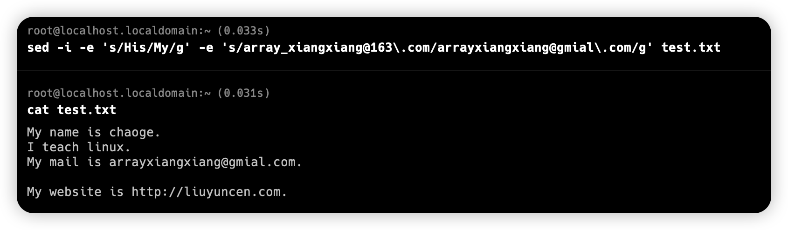

注意：`.` 记得用转译字符 `'\.'`

### 在第二行追加内容

```shell
sed -i '2a I is bad IT' test.txt
```

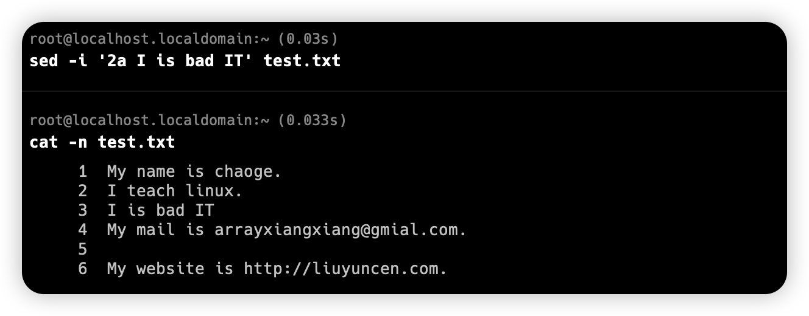

### 添加多行信息

```sh
sed -i '3a I like gril.\nI like beautiful gril' test.txt
```

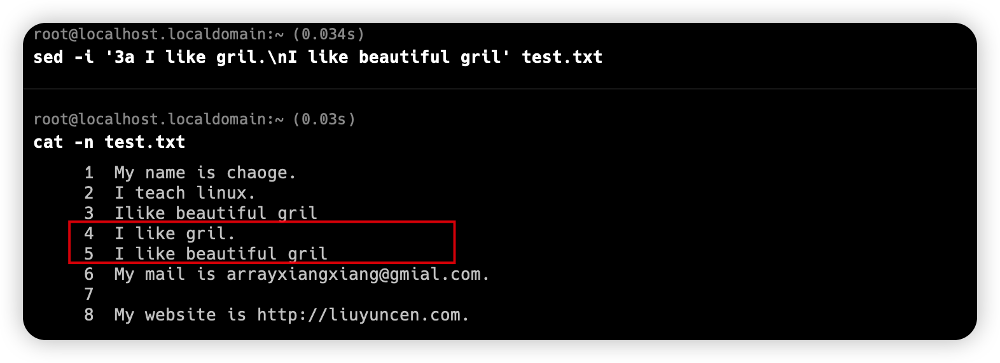

`\n` 代表换行

### 在每一行下面都添加

```shell
sed "a ------" test.txt
```


### 在最后一行添加

```shell
sed -i '1i添加的内容' filename # 在第一行前添加字符串 
sed -i '$i添加的内容' filename # 在最后一行行前添加字符串 
sed -i '$a添加的内容' filename # 在最后一行行后添加字符串
```

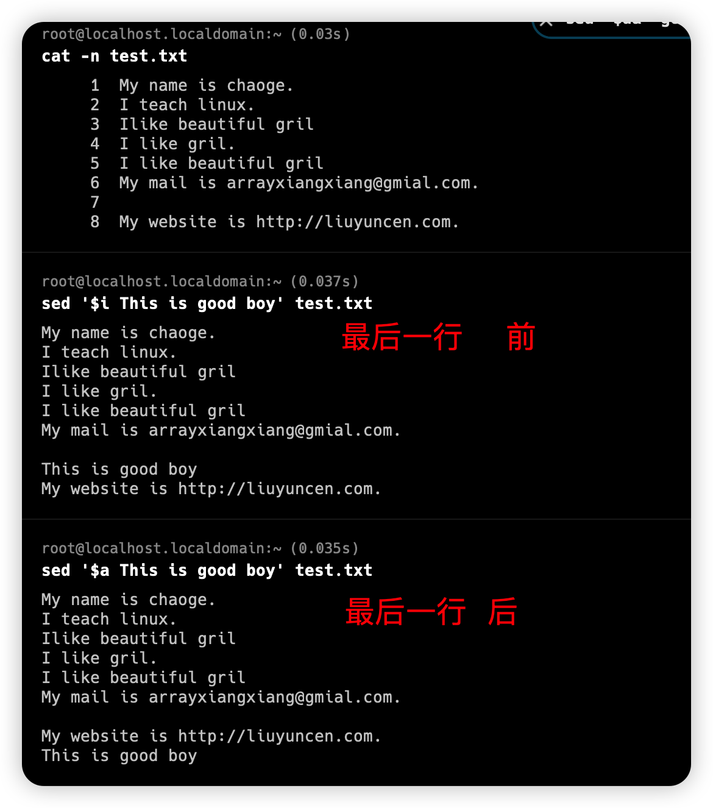

### 去除 Linux 的IP

结合正则，交给管道，掐头去尾法

1. 获取第二行

```sh
ifconfig | sed -n '2p'
```


2. /// 三斜杠替换法，### 也可以，@@@也可以

```sh
ifconfig ens33 | sed -n '2s/^.*inet//gp'
```

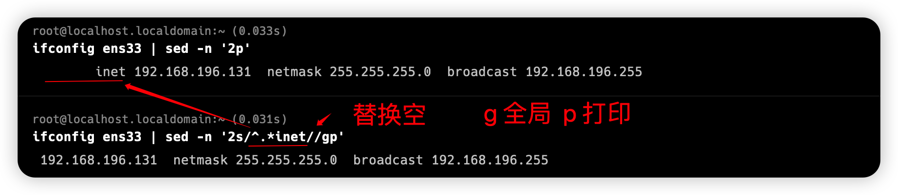

3. 再管道一次，去尾

```shell
ifconfig ens33 | sed -n '2s/^.*inet//gp'| sed -n 's/net.*$//gp'
```

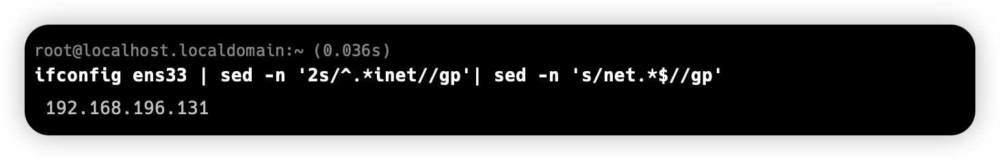

也可以直接用 `-e` 解决

```shell
ifconfig ens33 | sed -ne '2s/^.*inet//g' -e '2s/net.*$//gp'
```

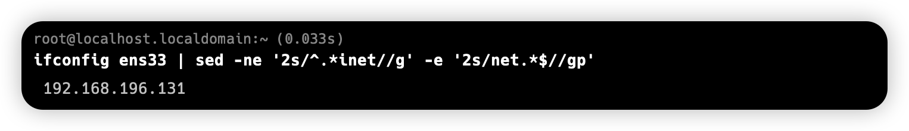


# awk

语法

```sh
awk [option] 'pattern[action]' file
awk  参数			'条件动作'   			 文件
```

awk 擅长文本格式化，且输出格式化后的结果，因此最常用的动作就是 print 和 printf

## 变量

| 内置变量              | 解释                            |
| --------------------- | ------------------------------- |
| $n                    | 指定分隔符后，当前记录的n个字段 |
| $0                    | 完整的输入记录                  |
| FS                    | 字段分隔符，默认是空格          |
| NF(Number of fields)  | 分割后，当前行有多少个字段      |
| NR(Number of records) | 当前记录行数                    |

## 参数

| 参数 | 解释                          |
| ---- | ----------------------------- |
| -F   | 指定分割字符                  |
| -v   | 定义或修改一个 awk 内部的变量 |
| -f   | 从脚本中读取 awk 命令         |

## 场景

### 列分割

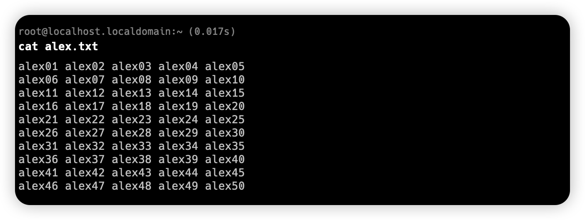

有这样一个文件，只打印第二列

```sh
awk '{print $2}' alex.txt
```

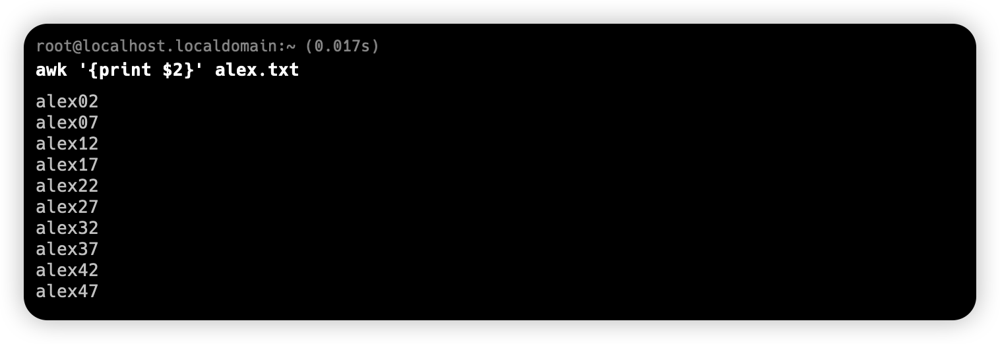

一次性输出 第二列和第四列

```sh
awk '{print $2,$4}' alex.txt
```

自定义输出内容

```sh
awk '{print "第二列",$2,"第四列"$4}' alex.txt
```

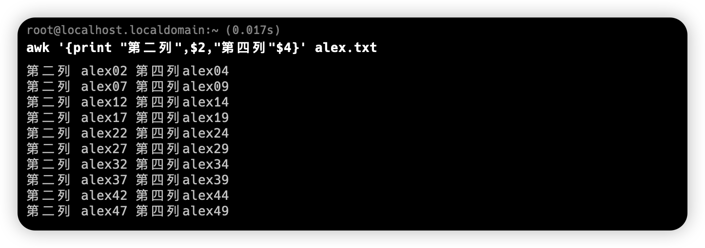

有逗号，就有空格，没有逗号，就不空格。

输出所有信息

```sh
awk '{print}' alex.txt
awk '{print $0}' alex.txt
```

### 行切割

创建一个文件 `cat /etc/passwd > pwd.txt`

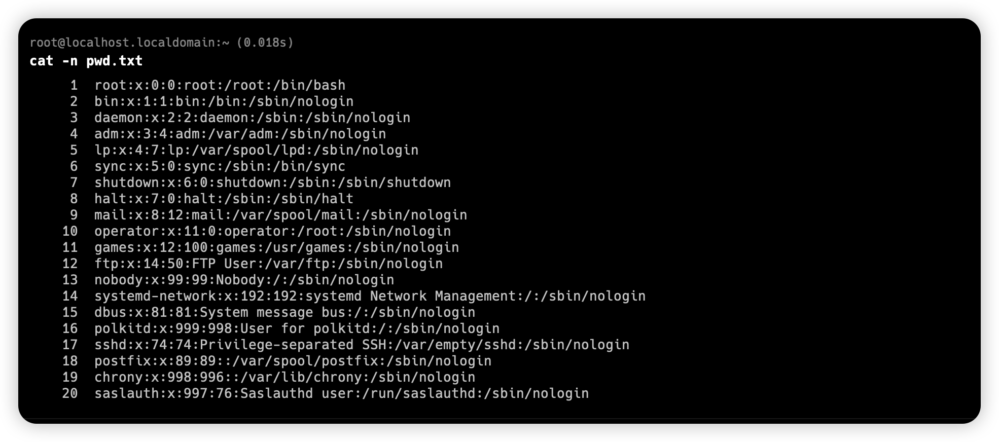

只显示第五行

```sh
awk 'NR==5'-n pwd.txt
```

显示 2-5 行

```sh
awk 'NR==2,NR==5' pwd.txt
```

显示 2、3、4、5 行

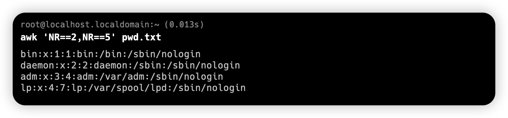

### 打印 IP

```sh
ifconfig ens33
```

我们可以定位到 第二行、第二列，就是我们所需的 IP 信息

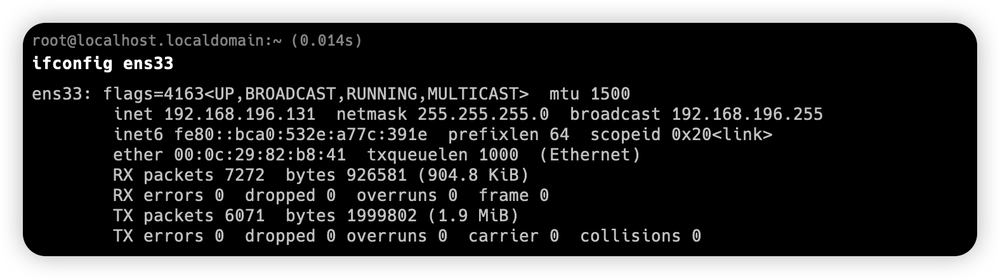

```sh
ifconfig ens33 | awk 'NR==2 {print $2}'
```

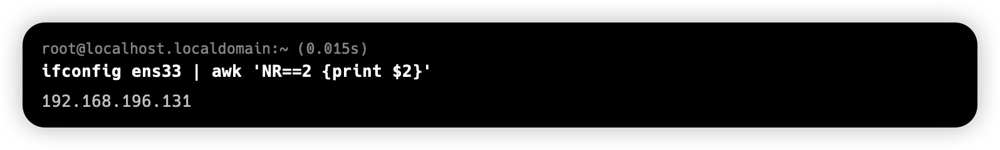

## -F 解决 : 冒号间隔

通过 `cat /etc/passwd > pwd.txt` 创建一个 `pwd.txt` 文件

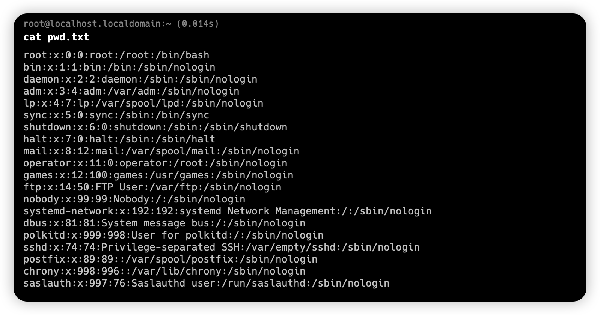

冒号看的有点乱，给他替换成 空格，然后再取出第三、四、五列

```sh
awk -F ':' '{print $3,$4,$5}' pwd.txt
```

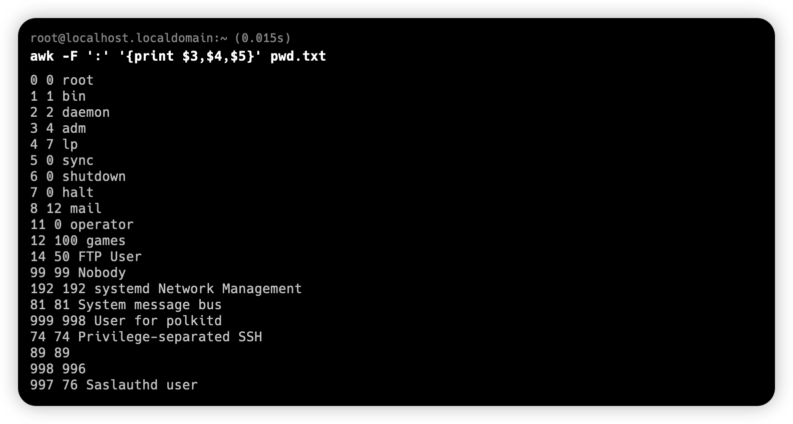

我就想拿倒数第二列和最后一列

```sh
awk -F ':' '{print $(NF-1),$NF}' pwd.txt
```

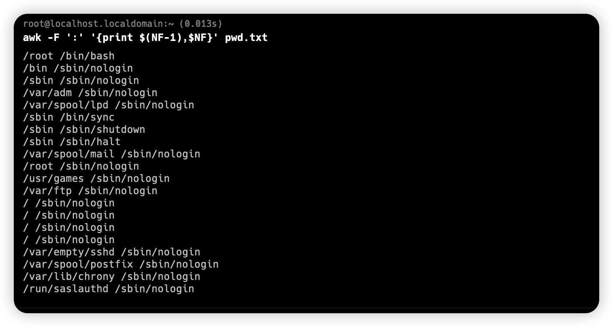

甚至碰到什么乱七八糟的分隔符，我们依旧可以使用 `-F ''` 来指定特殊分隔符


除了可以用 -F 来指定分隔符，我们也可以更改默认分隔符 FS

```sh
awk -v FS=':' '{print $1}' pwd.txt
```

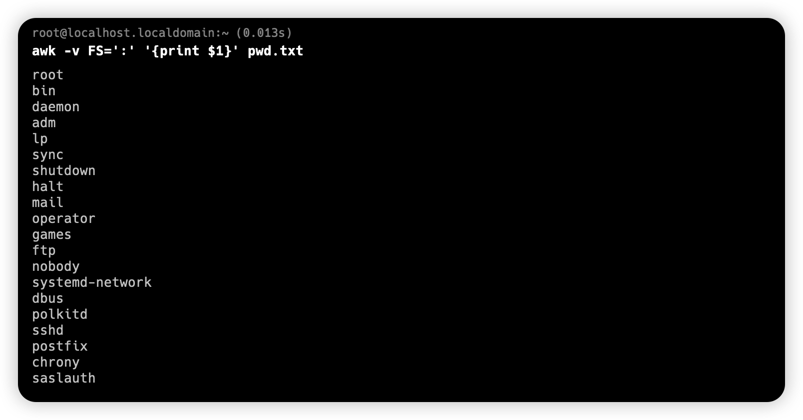

## OFS输出分隔符

我们知道 -v 可以修改默认分隔符，不仅可以修改默认输入分割符，也可以修改默认输出分隔符

```sh
awk -v FS=':' -v OFS='---' '{print $1,$3}' pwd.txt
```

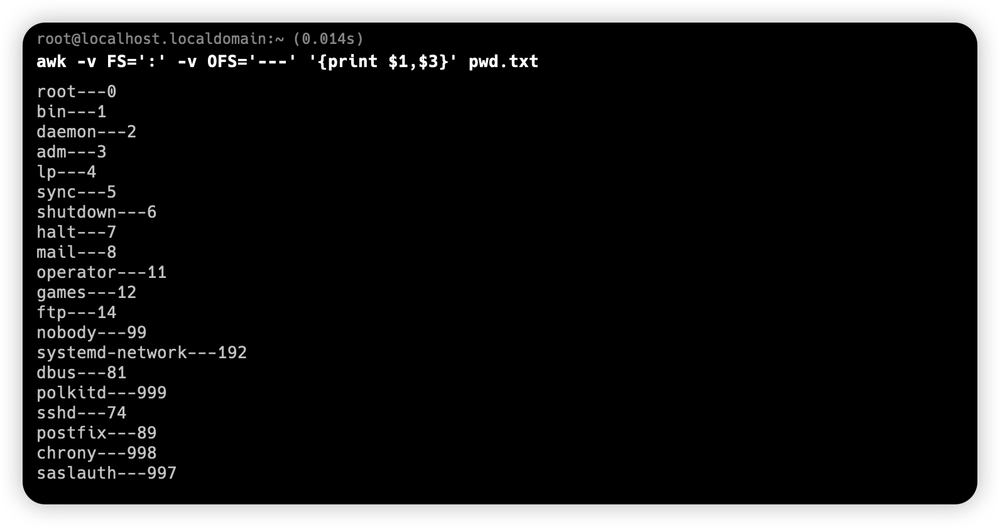

我们可以用 `\t` 让字符变得更好看

```sh
awk -v FS=':' -v OFS='\t\t' '{print $1,$3}' pwd.txt
```

## 内置变量 NR、NF

我想知道每一行又多少列，这样就可以打印列数

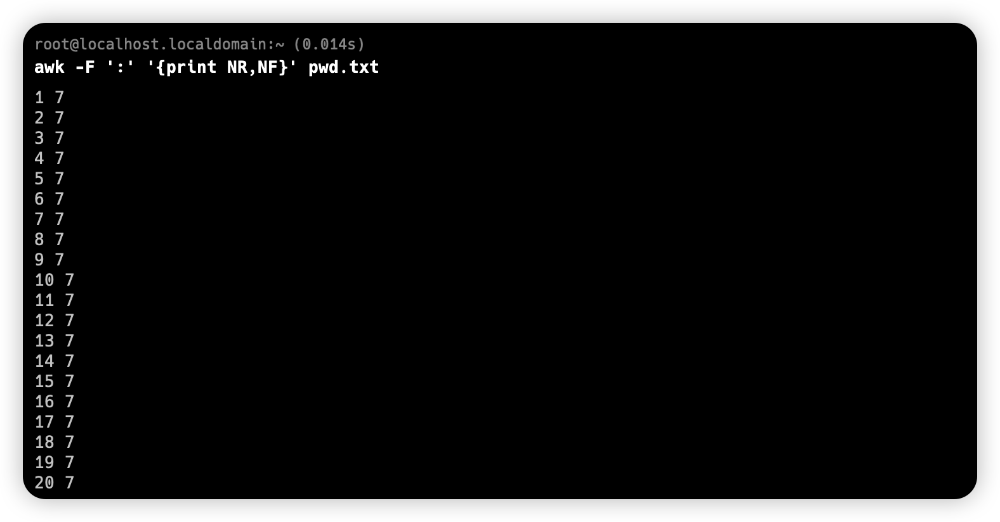

每行都有 7 列

显示一下文件名

```sh
awk '{print FILENAME,$0}' ps.txt
```

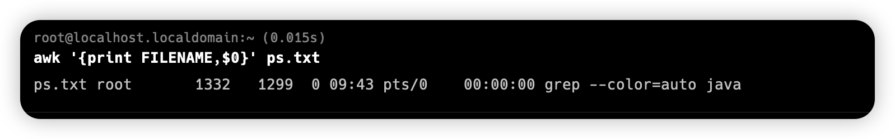

自定义变量 `-v value='hello'`

```sh
awk -v value='hello' '{print value,$0}' ps.txt
```


也可以间接引用 shell 

```sh
my='Good'
awk -v value=$my '{print value,$0}' ps.txt
```

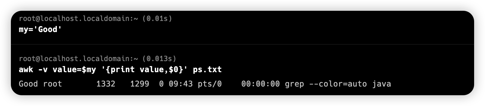

## printf 和 print 区别

学过 C 或 Go 语言的，肯定能随意玩耍了

```
%c				显示字符ASCII码
%d,%i			十进制整数
%e,%E			科学计数法显示
%f				显示浮点
%g,%G			以科学计数法格式或浮点格式显示数值
%s				显示字符串
%u				无符号整数
%%				显示%本身

示例： printf "%d"
```

```sh
printf "%s\n" a b c d
```

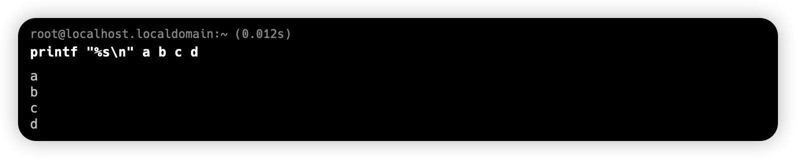

格式化打印用户信息，有这样 `user.txt` 文件

```
hello,18,beijing
wangli,20,shanghai
zhangshan,19,tianjing
lili,22,jiangxi
```

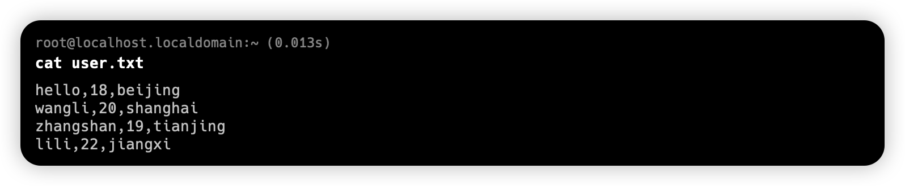

看我操作，自己琢磨去吧， `BEGIN` 在之前打印，

```sh
awk -F ',' 'BEGIN{printf "%-40s\t %-40s\t %-40s\n","姓名","年龄","地区"}{printf "%-35s\t %-35s\t %-35s\n",$1,$2,$3}' user.txt
```

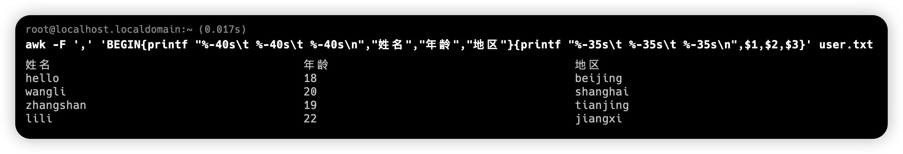

## BEGINE 和 END

```sh
awk 'BEGIN{ commands } pattern{ commands } END{ commands }'
```

```sh
awk 'BEGIN{print "前面"}{print $0}END{print "后面"}' ps.txt
```

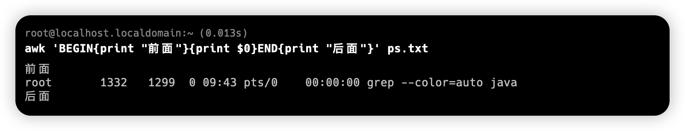

## 找出系统中禁止登录的用户

在 /etc/passwd 中匹配  /sbin/nologin 

```sh
grep -n '/sbin/nologin$' /etc/passwd
```

前后对比


使用 awk 正则匹配

```sh
awk '/\/sbin\/nologin$/{print $0}' /etc/passwd
```


