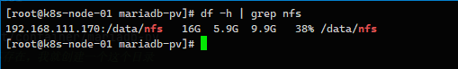

| IP              | host          | path      |
| --------------- | ------------- | --------- |
| 192.168.111.170 | k8s-matsrt-01 | /data/nfs |
| 192.168.111.171 | k8s-node-01   | /data/nfs |
| 192.168.111.172 | k8s-node-02   | /data/nfs |


Network FileSystem，标准的 CS 系统，基于 PRC协议传输

存储方式

+ 手动静态创建所需的 PV 和 PVC
+ 通过创建 PVC 动态创建 PV，无需手动创建 PV


### 安装工具

#### master 节点执行

```sh
 yum install -y nfs-utils rpcbind
```

如果目录不存在，则创建目录

```sh
mkdir -p /data
```

```sh
chown -R nsfnobody:nfsnobody /data
```


配置挂载权限 `/etc/exports`

```
/data 192.168.111.171(rw,sync,no_subtree_check,no_root_squash)  192.168.111.172(rw,sync,no_subtree_check,no_root_squash)
```

- `rw`：允许读写。
- `sync`：同步写入，保证数据写入磁盘后才返回响应。
- `no_subtree_check`：避免对子目录进行检查，提升性能。
- `no_root_squash`：允许远程 `root` 用户访问共享目录时具有本地 `root` 用户的权限。
- ro：只读访问
- async：nfs在写入数据前可用响应请求
- secure：nfs通过 1024以下安全 TCP/IP 端口发送
- insecure：nfs通过 1024以上端口发送
- wdelay：如果多个用户要进入 nfs 目录，则归组写入（默认）
- no_wdelay：多个用户进入 nfs 目录，则立即写入，当 async 时，无需设置此项
- root_squash：root用户的所有请求映射成 anonymous 用户一样的权限（默认）
- no_all_squash：保留共享文件的 UID 和 GID （默认）
- all_squash：共享文件的 UID和 GID映射匿名用户 anonymous，适合共用目录

启动挂载服务

```sh
systemctl start nfs-server

systemctl enable nfs-server
```


#### node 节点执行

```sh
mkdir -p /data
```

挂载 NFS

```sh
mount 192.168.126.170:/data /data

mount 192.168.58.170:/data /data
```

编辑自动挂载，避免重启后丢失` /etc/fstab`

```sh
192.168.126.170:/data/nfs /data/nfs nfs defaults 0 0

192.168.58.170:/data /data nfs defaults 0 0
```

自动挂载

```sh
mount -a
```


查看可挂载

```sh
showmount -e 192.168.126.170
```


子节点执行 df -h 查看挂载情况，等进行 读写相关测试验证




删除挂载

```sh
umount /data

# 强制删除
unmont -l /data/nfs
```


