> 2022年9月20日

## 搭建网络可用的虚拟机


我的资源：工具>开发工具>Linux镜像>A971

>  CentOS镜像：链接: https://pan.baidu.com/s/1BgHK3OQNekiHeuhUAcxXiw 提取码: tq24


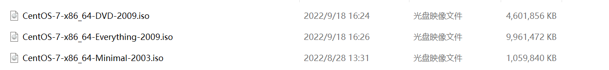

准备可用的CentOS镜像文件

### 1、创建虚拟机


这里根据 VMware Workstation 的版本来定 

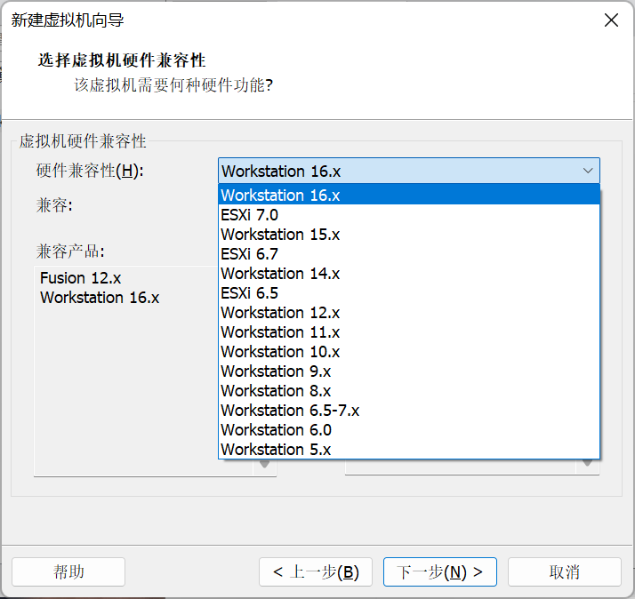

选择可用的镜像


选择虚拟机的工作路径，这个路径会是这个虚拟机的所有磁盘路径

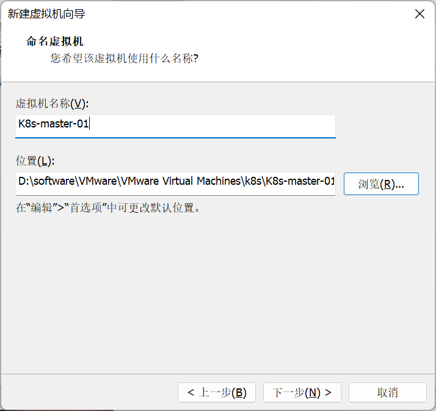

配置CPU 和 内存等

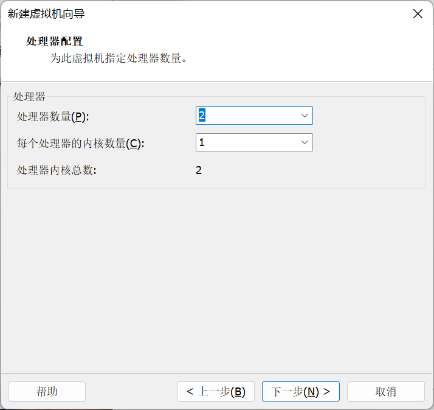

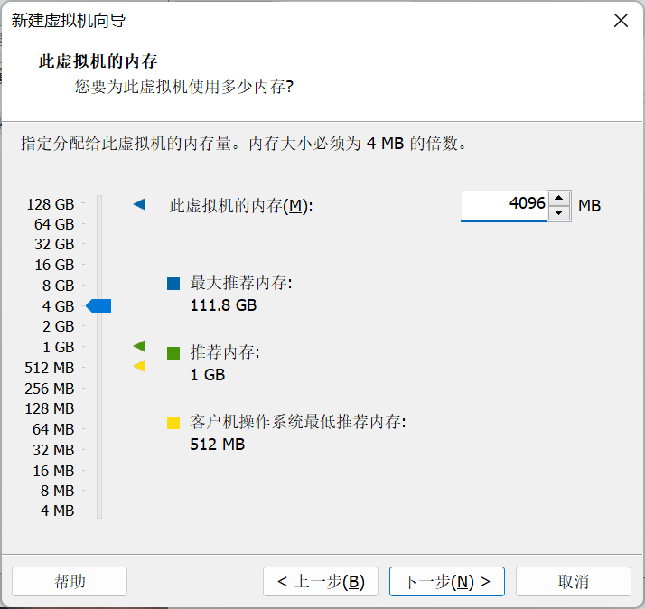


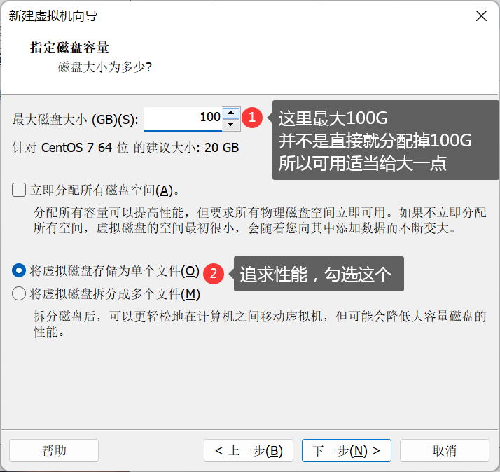

### 2、安装系统

因为镜像是 CentOS7 所以这里有两个选项，安装CentOS7 和 测试并安装 CentOS7，选哪个都可以

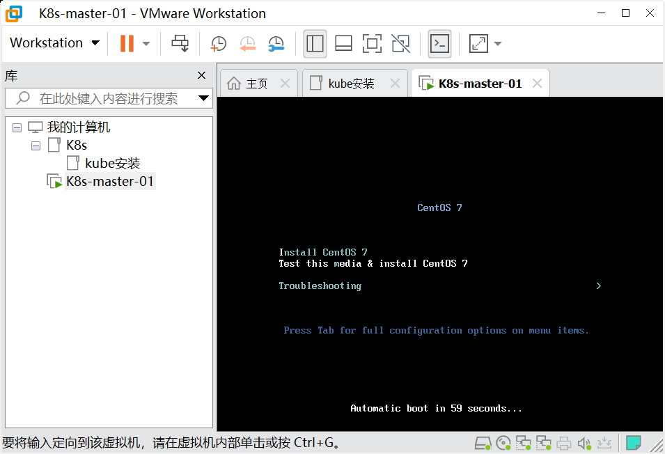

选择语言，这个每人会选错吧


自动都配置好了，最后设置一下密码，本地虚拟机安全性就没那么强了，这么好记用什么

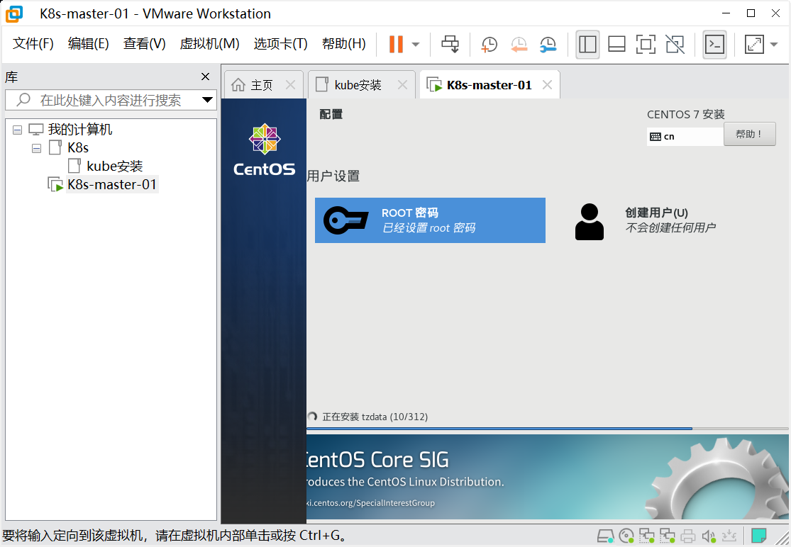

最后重启就可以了

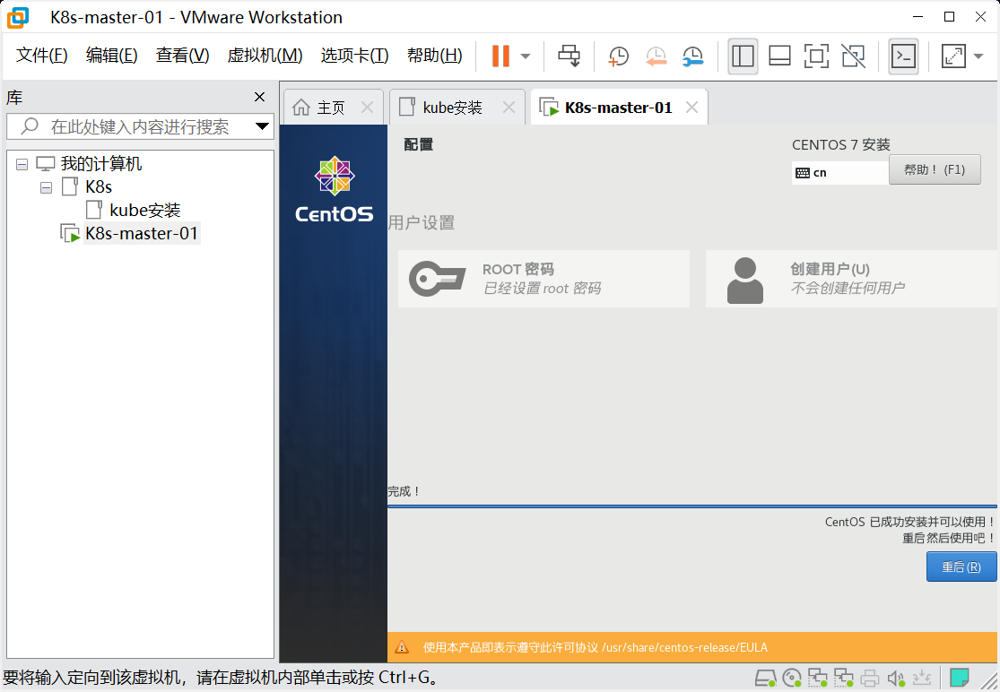

### 3、进入虚拟机

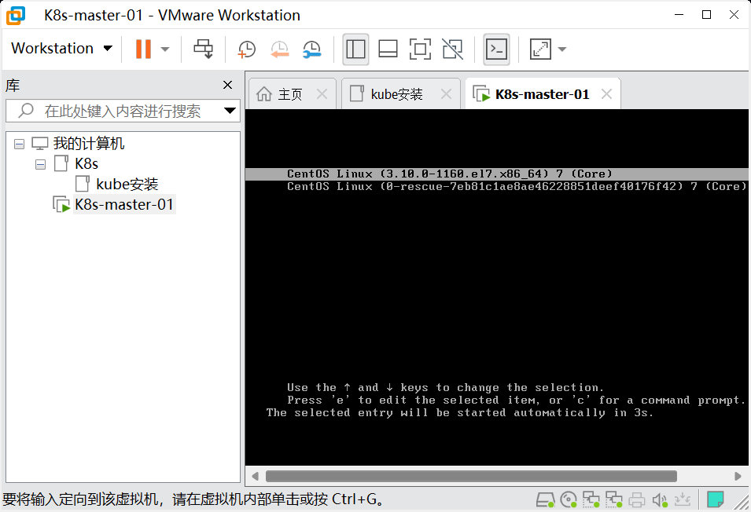

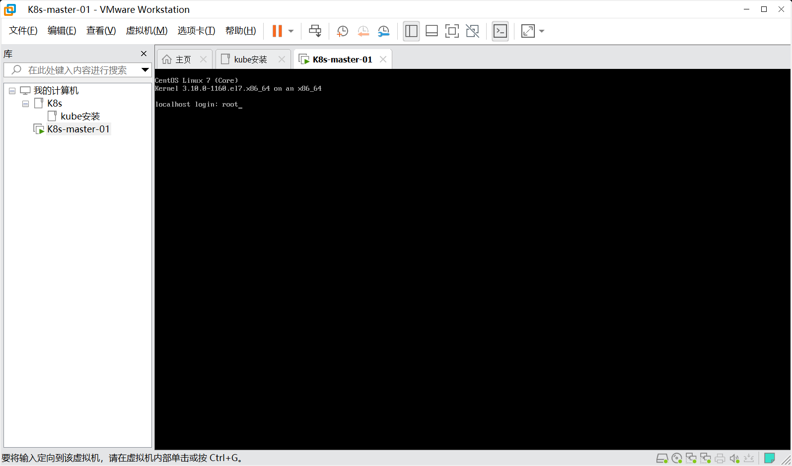

这样就进来了

一般的服务器是没有 `ifconfig` 这个命令的，我们查不到虚拟机的IP地址，所以需要去配置一下

#### 3.1、安装 ifconfig

```sh
yum search ifconfig
```

但是出现了个这个问题

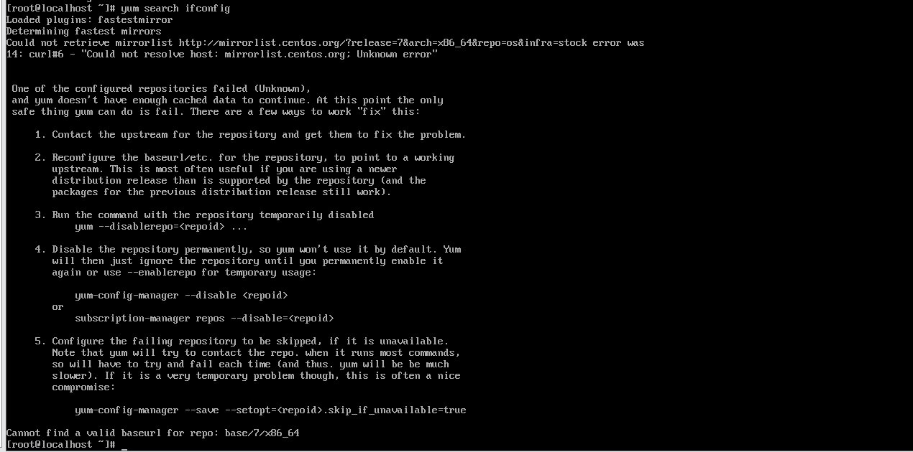

```sh
cd /etc/sysconfig/network-scripts
```

找到 `ifcfg-*` 开头的文件，修改配置文件中的 `ONBOOT `属性为 `yes`

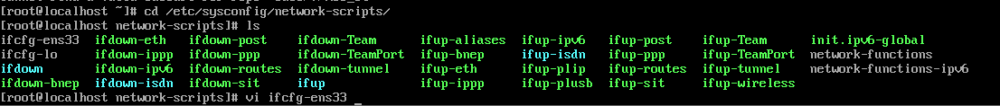

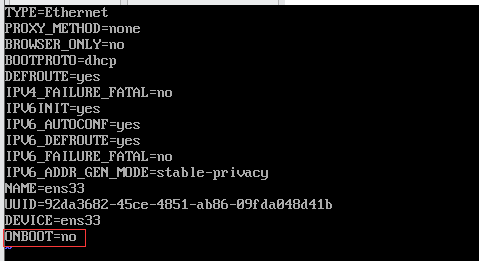

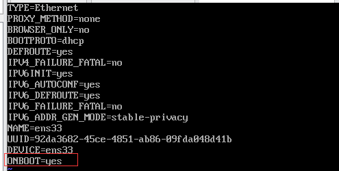

然后重启虚拟机就可以了

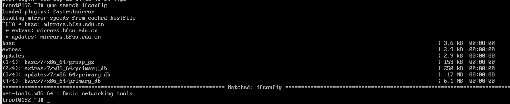

这样就解决了

```sh
yum install net-tools.x86_64 -y
```

```sh
ifconfig
```

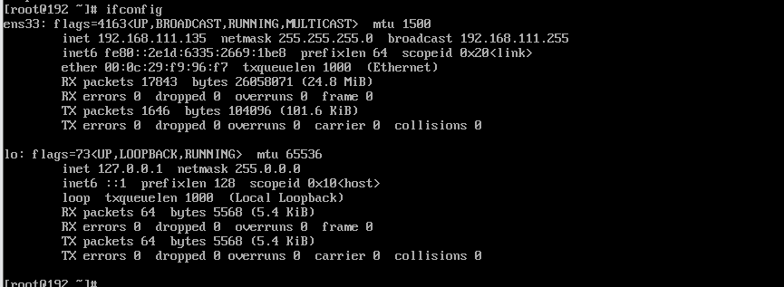

这样就知道这台服务器的IP为 `192.168.111.135`

因为用 VMware 自带的控制台太不方便了，我们还是换一个工具 XShell

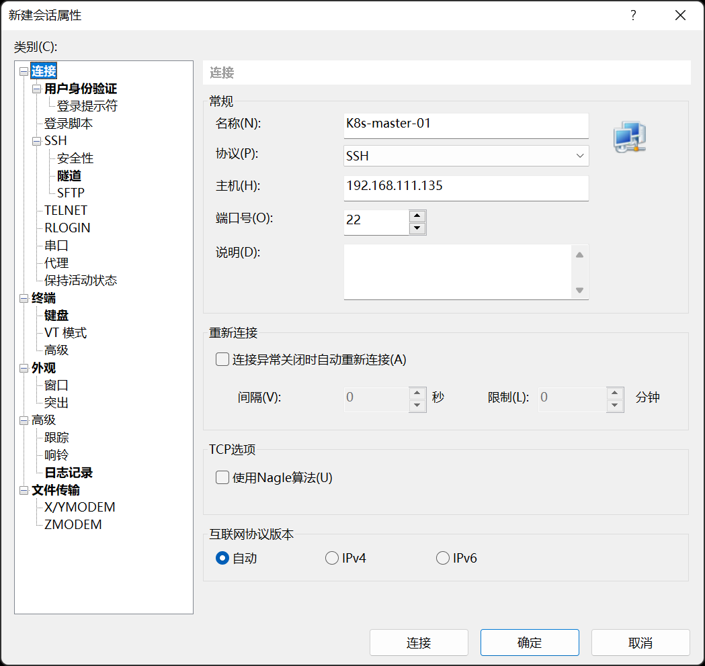


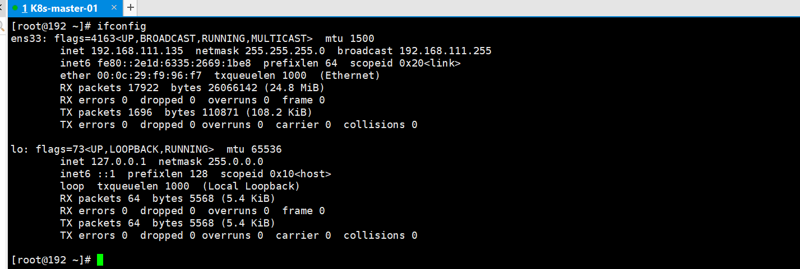

这样我们的虚拟机就搭建好啦

