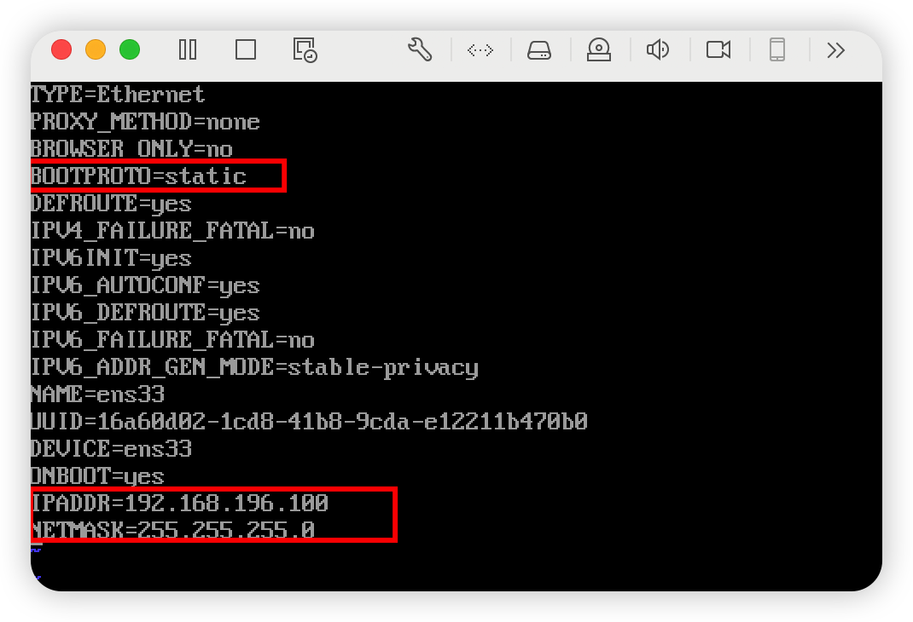
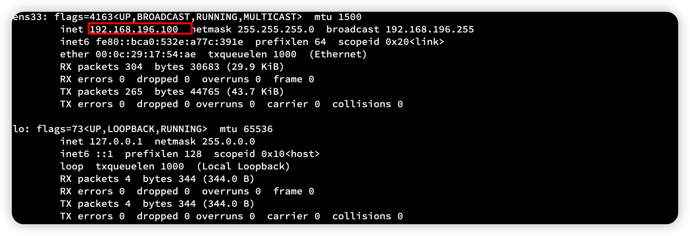

## 固定虚拟机IP

root 权限 操作

```sh
cd /etc/sysconfig/network-scripts
```

一般情况会有个文件名为 `ifcfg-ens**`  的文件

我这里是 ifcfgs-ens33

```
vim ifcfgs-ens33
```



```
TYPE=Ethernet
PROXY_METHOD=none
BROWSER_ONLY=no
BOOTPROTO=static			# 改成 static
DEFROUTE=yes
IPV4_FAILURE_FATAL=no
IPV6INIT=yes
IPV6_AUTOCONF=yes
IPV6_DEFROUTE=yes
IPV6_FAILURE_FATAL=no
IPV6_ADDR_GEN_MODE=stable-privacy
NAME=ens33
UUID=16a60d02-1cd8-41b8-9cda-e12211b470b0
DEVICE=ens33
ONBOOT=yes
IPADDR=192.168.196.100   # 你想要服务器变成什么IP 这里就填什么IP
NETMASK=255.255.255.0    # 验码默认是这个
```

修改完保存

```sh
# 重启网卡
service network restart
```


此时 ifconfig 查询

