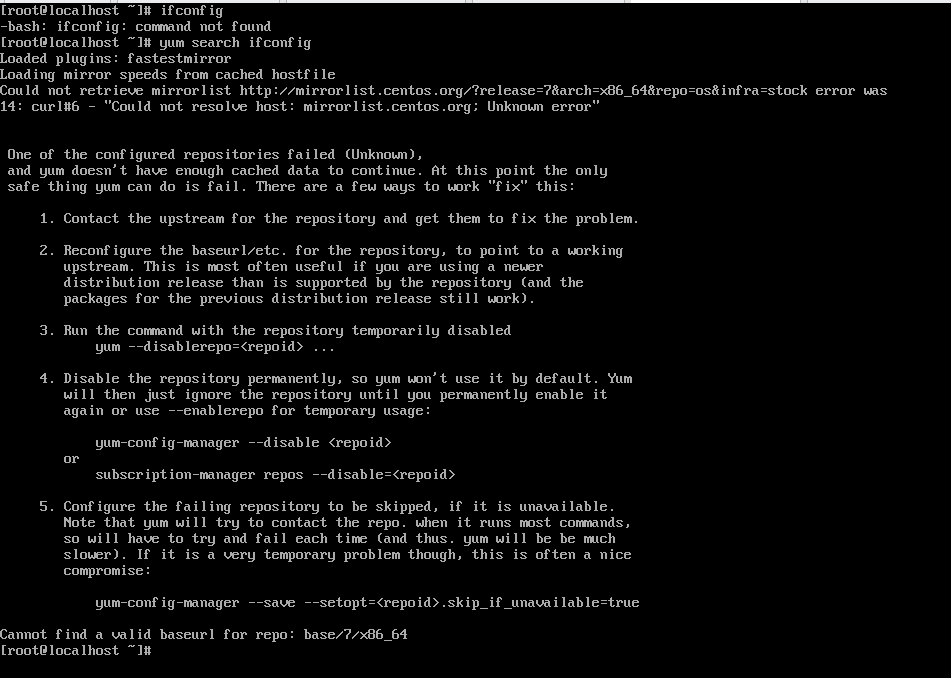
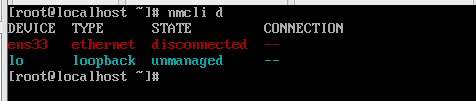
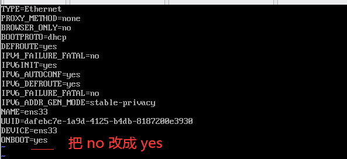
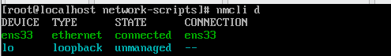
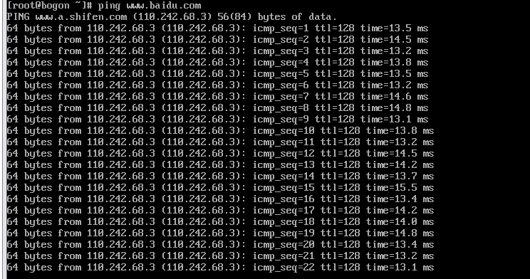

> 创建于2022年8月29日

# Could not resolve host: mirrorlist.centos.org； Unknown error 的解决方法 

初始化的Linux服务器没有网络出现



**本机无法连接网络的网络设置**

## 解决方案

输入 `nmcli d`，`ens33` 处于 disconnected 状态



修改网卡配置

```sh
cd /etc/sysconfig/network-scripts
vi ifcfg-ens33
```



重启网络

```sh
systemctl restart network
```

重新查看网卡状态



```sh
ping www.baidu.com
```



大功告成